# 游戏手册

# 简介

Meshal Lite是一款用于共同创造冒险故事、并且注重于简洁和快节奏的游戏规则。使用这款游戏规则，你将与朋友们一起创造并扮演属于自己的生动角色，在各类游戏世界中探索秘密、发掘真相、挑战敌人或各类怪物，甚至左右游戏世界中的政治局势。Meshal Lite适用于多数游戏世界，比如：你可以在原始世界中狩猎耕种，为自己的部落寻觅生存的物资；也可以在神话时代扮演超凡的英雄，与传说中的魔物对抗；亦或是在中世纪扮演一名行侠仗义的骑士或潜藏于阴影中的刺客，为自己的使命与信仰而奋战；同样，你也能够在现代世界中扮演一名特工，亲身参与暗流汹涌的谍战斗争；或是在即将到来的星际远航中，作为一名探险家探访未知的星球——这一切都取决于你与游戏伙伴们的想象力。使用Meshal Lite进行游戏前，你应当了解以下要素：

## 玩家（Player）与主持人（Host）

作为玩家，你将与其他玩家一同进行游戏。通常每位玩家都控制着一名（或更多）游戏角色，你可以控制自己的游戏角色在游戏世界中生活、冒险、成长与战斗。游戏外的你就是游戏角色的灵魂，你的思想决定了这个角色在游戏世界中所做的一切。

主持人是整个游戏的仲裁者与故事的叙述者，相当于一位“超级玩家”。作为主持人，你控制着所有非玩家角色们与玩家协作互动或唱对台戏、设立难题或引导玩家们深入剧情和阴谋中。在游戏中，主持人根据玩家们的行为决定游主持人是整个游戏的仲裁者与故事的叙述者，相当于一位“超级玩家”。作为主持人，你控制着所有非玩家角色们与玩家协作互动或唱对台戏、设立难题或引导玩家们深入剧情和阴谋中。在游戏中，主持人根据玩家们的行为决定游戏的情节发展，判断这些行为的结果（甚至在必要时利用暗掷操纵结果）。通常在游戏遇到争议时，主持人往往拥有最终的裁定权。

## 关系（Relationship）

在游戏世界中，你会遇到各式各样的敌人，也会遇到处于不同目的伸出援手的伙伴，但更多的是与你井水不犯河水的陌生人。关系并不是一成不变的：你可能会伤害到过去的朋友，与其反目成仇；也可能与某个对脾气的家伙不打不相识，最终成为朋友；有时候，老对手也会互相联手对抗更加强大的敌人。

### 友善（Friendly）

与你关系友善的生物会时刻对你伸出援手、赠予你礼物和提供帮助。通常，只有双方都相互认可时，才被视作友善关系。通常，一起进行游戏的玩家角色多视为友善关系。

### 中立（Neutral）

虽然中立生物不会敌视你，但通常也不会帮助你。事实上，只要你不损害中立生物的利益，他们并不在乎你做些什么。

### 敌对（Hostile）

意图加害你的角色都被视作敌对，比如：在战场上拼死厮杀的双方，或是阻挠你达成目标的对手等。

## 规则（Rules）

在游戏中，或许你会遇到一些规则不曾提及的情况——甚至有些时候，在规则中的确曾经说明相关情况的处理方法，可是你和你的游戏伙伴一时未能找到这些规则条目在哪里。这些情况都可能引起争议。请记住，游戏规则是为了创造令人愉悦的游戏而服务，因此变通地理解规则会让游戏变得更顺畅。如果发生了争议，请与你的游戏伙伴共同商讨解决方案。请始终牢记：游戏规则只是为了游戏服务，切勿因为入戏太深而失去宝贵的友谊——**规则并不那么重要，乐趣才是游戏的灵魂！**

### 基础规则（Basic Rules）

在Meshal Lite中，只保留了最必要的部分作为规则主体，用来诠释最常用的游戏过程与情况。基础规则被罗列于本规则手册中，是进行游戏时的通则。当然，在许多时候，包括扩展规则和自定规则、诸多特征、能力和物品等游戏元素都可能包含基础规则之外的特例。请注意：基础规则仅用于处理特例之外的“空白”部分。因此，如果遇到特例与基础规则相悖的情况，请总是采用特例的规定。

### 扩展规则（Alternative Rules）

扩展规则是对基础规则的补充，它在基础规则之上进行了适当的追加，用于提供更真实或更具策略性的游戏过程，在每一段扩展规则前，都会标记“[扩展]”来表示。主持人与玩家们可以自由决定在游戏中采用哪些扩展规则。通常，如果一项扩展规则与基础规则相悖，那么请总是采用扩展规则。除此以外，自定规则或是其他游戏元素中的特例都将高于扩展规则。

### 自定规则（Customized Rules）

在进行游戏时，主持人与玩家们也完全可以一同发挥创造力，创造出独有的自定规则、或是自定全新游戏元素（比如创造出新的种族、新的物品或能力）、甚至是颠覆原有的所有要素，独创出截然不同的游戏规则和故事风格。请注意：如果一项自定规则与基础或菊展规则相悖，那么请总是采用自定规则。

## 如何游戏

在整个游戏过程中，主持人与玩家共同遵循下述三个主要环节，轮流推动游戏的进展：

### 描述环境（Describe Environment）

作为游戏的主持人，你可以用任何所能想到的方式描述游戏世界，告诉玩家们他们所处的情境。包括玩家所处的位置（比如：身处一间密室、位于狭长的过道内、在一座边陲小村中等）、时间（比如：距上一次战争十年后、在清晨旭日尚未完全升起时、在晚宴主菜送上餐桌前）、周遭显而易见的事物（比如：一条矿车轨道直通洞口的深处、一张长条餐桌的尽头正坐着一位泰然自若的贵族、在服务器机房中闪烁着点点幽光等）。对于环境的描述往往取决于主持人的游戏风格，某些主持人可能言简意赅，只对周遭环境做出大致的描述，留给玩家足够的想象空间；另一些主持人则可能事无巨细地描述一切，甚至配以图片与精致的道具，使玩家能够具象地认知所处的环境。无论是哪一种风格，都应当确保玩家能够掌握最基本的信息：“我在哪里”和“这里有什么”。

### 声明行动（Declare Actions）

根据主持人的描述，玩家可令自己的角色做出行动。比如：打开位于北边的铁门、潜藏在角落的阴影中、用手中的武器攻击对手等——你可以声明做出任何合乎逻辑的行动。在游戏中常用到三种时间跨度：简述、叙事和瞬息过程。在不同过程中，对于行动的描绘也多有不同：简述过程适合进行概括式的行动（比如：进行一段长时间的休整、从一个城市旅行至另一个城市）；叙事过程适合于日常行动或一组行动（比如：调查房间内的装饰、在酒馆中向酒保打探消息）；瞬息过程则如同电影中的慢镜头，角色们在同一段短暂的时间内交替做出行动（比如：在刀光剑影中闪躲腾挪、在枪林弹雨中交替掩护前行）。通常，玩家和主持人都应具体描述各自角色的行动，并确保给出最基本的信息：“谁”、“对什么目标”和“做出怎样的行动”。

### 判定结果（Determine Results）

在玩家声明自己的行动后，主持人往往需要判断行动的结果。某些简单的行动将直接得到结果（比如：坐上矿车、推开一扇没有上锁的门、拾起一件物品），但若这个行动存在难度（比如：搬起一块沉重的岩石、破解一道密码锁）或有几率失败（比如：与对手角力、向远处的标靶射击），那么就需掷骰来判定结果。无论用何种方式得到结果后，主持人都应对行动的结果做出描述——精彩的描述将渲染游戏的气氛，使游戏过程变得如同史诗般精彩；而简洁的描述也可使情节显得紧凑干脆，如同动作大戏般令人应接不暇。总之，玩家通过这些描述了解自己的行动成果，这些结果往往也引向之后的游戏剧情，或是产生了更多可能性（比如：在玩家决定打开北边的铁门后，主持人应描述铁门后的环境），从而使游戏环节回到描述环境的步骤，如此循环往复。

## 常用计算

在游戏中通常只需用到一些最为基础的数学知识。比如：四则运算、比较大小等。

### 算式（Expressions）

在游戏中，你可能会运用到四则运算：+为加法、-为减法、×为乘法、÷为除法。与学校中习得的数学知识相同：总是先乘除，后加减，并优先计算括号内的部分。有时候，你可能会遇到无法整除的情况（比如：3÷2=1.5），通常小数部分总是在得到最终结果时舍去（比如：1.5被取整为1）。

### 孰高（Take Higher）与孰低（Take Lower）

孰高表示你将在多个数字中取最高者，反之孰低则表示在多个数字中取最低者。

### 差值（Deviation）

如果需要计算两个数字的差值，那么用较高的数字减去较低者，所得的结果即为差值。

## 掷骰

在游戏中，你经常需要掷出骰子，并根据骰子的结果来决定某个行动或事件的结果。游戏中的所有掷骰都只需用到六面骰。遇到如“3🅟”或“强壮骰🅽”的说明时，你就需要掷出指定数量的骰子并计算结果：根据要求掷出骰子，当骰子静止后，每颗骰子朝上那面的数字就是掷骰的结果。

有时候，你需要在掷骰前进行计算——你应当先计算符号🅟或🅽前的部分，得到掷骰所需的骰子颗数，比如：掷4+3🅟时，须掷出4+3=7颗骰子。请注意：如果掷骰数≤0颗，就意味着此次掷骰的结果必然为0。

### 骰子（Dice）

在游戏中，你所用到的骰子都是六面骰（俗称D6），骰子的每个面上分别标有1至6的数字。

### 点数（Points / 🅟）

掷骰后，数字为1的骰子为1点、数字为2的骰子为2点，其余骰子都为0点。求取点数的掷骰用“🅟”表示，比如：“3🅟”表示掷出3颗骰子并统计它的点数；“强壮骰🅟”表示你须掷出自己的强壮骰并统计点数。

> 凯瑞达须掷4🅟，他掷出4颗骰子，分别得到数字3、1、2、6。统计这次掷骰的数字：将数字为1的骰子记作1点、将数字为2的骰子记作2点，另2颗骰子为0点。因此，凯瑞达得到了0+1+2+0=3点作为此次掷骰的结果。
> 

### 骰面（Number / 🅽）

掷骰后，将所有骰子的数字相加就得到骰面结果。求取骰面数字的掷骰用“🅽”表示，比如：“2🅽”表示掷出2颗骰子并计算数字总和；“活力骰🅽”则表示须掷出自己的活力骰并计算数字总和。求取骰面的掷骰常用于计算较大的数字结果，比如：先手排序、计算议价的成果、衡量置办物资的数量等。

> 在开始战斗时，崔妮蒂掷活力骰🅽决定自己的先手。她有6颗活力骰，将它们掷出后分别得到数字2、3、3、4、1、5。她将这些骰子的数字相加得到2+3+3+4+1+5=18。因此，崔妮蒂得到了18作为结果。
> 

作为掷骰者，你也可以主动地减少掷骰所用的骰子颗数，这类决定通常用于留手，但你不能减少掷骰得到的结果。比如：拷问俘虏时，你控制出拳的力度（减少掷骰数量），但仍有可能因为力道没有控制住而失手打晕对方（依然掷出了2点）。如果将掷骰数减少至0颗，就意味着你放弃了此次掷骰。掷骰时，你应当一次性掷出所有用于掷骰的骰子——将骰子拆分成数颗分批掷出会导致游戏过程显得拖沓，也难免有玩弄命运的嫌疑。

### 尝试（Attemption）与难度（Difficulty）

当你试图达成某项困难目标时（比如：试图推开一扇沉重的大门、在过独木桥时保持平衡、辨别赝品），就需掷骰尝试。每次尝试都需与这件事的难度进行比较：若掷骰的结果>难度，那么尝试就算成功，反之则视为失败。难度最低为0，即使因为各种因素某次尝试的难度降至0以下，在游戏中你仍应将其视作0。

对于某些复杂而需长时间完成的尝试，主持人往往会允许你累加掷骰结果（比如：破译一段密语文书、在金融市场中进行投资买卖、入侵重重防火墙下的操作系统），这类尝试被称作累加尝试（Progressive Attemption）：你可以在每个尝试周期中掷骰并将结果累加，直至结果总和>难度后即视作成功。如果某项累加尝试没有时间限制，那么这项尝试通常最终都能取得成功，主持人可以选择省去繁琐的掷骰，只需计算用于此次尝试的时长——用难度×2÷掷骰颗数×每次尝试的时长，就将得到这次累加尝试花费的时间。

> 一道石门立于艾多夫面前，这道大门由一块完整的巨岩打造，厚重而坚实。

艾多夫：“我试着用力推开这道石门。”

主持人请艾多夫掷强壮骰🅟（难度5），艾多夫掷得3。

主持人：“你使劲推着石门，然而它实在太过厚重，即使你倾尽全力也难以推动分毫。”

艾多夫：“那么，我要检查一下这道门附近是否有什么机关可以驱动它。”

主持人请艾多夫掷精神骰🅟（难度为1），艾多夫掷得2。他发现在石门一侧有一块巴掌大小的石盘，在石盘上有规律地排布着九颗鹌鹑蛋大小的卵石。显然这是一道密码机关，但艾多夫并不知道该用何种顺序破解它。

艾多夫：“我要反复尝试，直至破解密码为止。”

于是，主持人请艾多夫每分钟掷一次精神骰-3🅟进行尝试（由于对密码毫无头绪，每次掷骰都将减少3颗骰子）。这项尝试将持续至累加点数超过难度30为止。直至数十分钟后，艾多夫凑足了超出难度的点数，他终于试出了正确的密码。
> 

| 难度 | 难度说明 |
| --- | --- |
| 0 | 毫无难度的尝试，只要别太粗心，通常总能成功。为了加快游戏的进程，主持人可直接将此类尝试判作成功。举例：举起一张桌子、用扳手拧螺帽、心算加减法。 |
| 1~2 | 轻松的尝试，但需要稳定地发挥技巧，并凭借一点点的运气。举例：徒手掰开苹果、在独木桥上保持平衡、鉴别某个常见的符号。 |
| 3~4 | 这类尝试需要一定的技巧与天赋、或是依靠一些好运气。举例：推动一道沉重的石门、跃起并抓住半空中的飞盘、在人群中一眼发现特定的面孔。 |
| 5~6 | 除非你有很高的天赋，否则就需要精湛的专业能力才能完成这项尝试。举例：推翻一座巨大的石像、在滑雪时做出特技动作、解答冷门的数学难题。 |
| 7~8 | 只有经过严格的训练、超常的发挥和坚定的意志才能达成这项尝试。举例：挣断束缚你的镣铐、偷走守卫手中的剑、在一整天的大雨后寻找猎物留下的踪迹。 |
| 9或更高 | 凡人通常无法达成这类尝试，即使是强大的英雄也需仰赖好运的眷顾才能完成它。举例：徒手阻住一辆疾驶的车辆、在高楼外壁奔跑并安然落地、辨认一道失传已久的符文。 |

### 对抗（Contestation）

某些时候你须与对手进行较量（比如：扳手腕、交易时讨价还价），此时参与对抗的角色就需分别掷骰，结果较高者将赢得此次对抗，结果相同则视作平手（Tie）。

如果一次较量需要长时间才能决出胜负（比如：互相追逐、进行一场诉讼辩论），那么可用累加对抗（Progressive Contestation）的方式：对抗者分别累加掷骰结果，最先达到约定数量的一方将赢得对抗。

### 援助（Assist）

在某些情况中，你可以为别人的尝试或对抗提供援助，主持人可以根据具体情况，决定如何计算援助的掷骰结果：

- 可通过合力提高效率的行动（比如：合力推开一扇沉重的石门），援助者可将自己的掷骰结果累计入被援助者的掷骰结果。
- 需要精密操作，依赖技术和知识理论的行动（比如：解开一道数学谜题），援助者与被援助者的掷骰结果取孰高。

### 重掷（Re-roll）

有时你需要推翻先前的掷骰结果，然后重新掷骰计算。根据重掷的说明，你须挑选符合要求的骰子重掷，比如：“重掷点数为0的骰子”或“重掷骰面为2的骰子”。

### 暗掷（Secret Roll）

当玩家角色试图获取隐秘的信息（比如：识破假象或谎言、甄别艺术品的真伪）时，掷骰的结果将透露出过多的信息；当主持人需要处理机关陷阱的运作、决定暗处埋伏的敌人或是悄悄决定剧情走向时，让玩家知晓掷骰结果显然并不合适。此时，主持人就应当进行暗掷——通常只有主持人能知晓暗掷的结果。如果主持人要求一位玩家暗掷，那么这次暗掷的过程与结果应当仅由主持人与该玩家知晓。

> 崔妮蒂试图从一位奸猾的情报贩子口中套出有用的消息，在唇枪舌剑一番过后，主持人须决定这位情报贩子是否说谎。

主持人为崔妮蒂暗掷精神骰🅟，用于判断她是否诱使情报贩子说出了实话（难度3）。这次暗掷得到点数2，因此崔妮蒂并没有成功从对方口中套出重要的情报，情报贩子反而道出了一条假情报（然而她本人并不知道这一点）。

当崔妮蒂循着情报来到这处废墟时，主持人为她再次暗掷精神骰🅟以判断是否能发现废墟中的足迹（难度1）。

这次暗掷得到了点数2，超出了难度，因此崔妮蒂发现了在废墟墙角处的足迹。

主持人：“警觉的你发现了前方的灌木丛中有一道新鲜的足迹，看起来像是近期新踏出来的。”
> 

# 角色

在开始一场精彩的冒险之旅前，每位玩家都须拥有一位属于自己的角色，在本章节中，你将了解构成角色的要素，以及如何创建出一个属于你的角色。你的角色将是你在游戏世界中的投影，你可以根据自己的设想，调配属性、选择特征、搭配能力与物品，从而创建出初始的角色。在之后的游戏历程中，你也可以不断地调整自己的角色，从而创造出独属于自己风格的角色。

- 角色（Character）与生物（Creature）
    
    角色与生物泛指游戏中一切广义上的生灵，包括每一个平民百姓和英雄、也包括神祇与魔兽、甚至是由能量驱动的人工智能。由玩家控制的角色被称作玩家角色（Player Character）——与其相对地，由主持人控制的所有角色与生物被统称为非玩家角色（Non-player Character）。
    
- 角色卡（Character Sheet）
    
    你可以将自己的角色记录在任何载体上，一张随手可得的纸张、一本笔记本、一份电子文档……这些载体被称作“角色卡”。你可以在角色卡上记录一位角色的特征、属性、能力、物品和一切与该角色有关的资料。
    
- 预设角色（Preset Character）
    
    Meshal Lite预设了一些可供直接使用的角色卡。对于准备时间有限的玩家，使用预设角色将会是一个不错的主意。
    

## 特征（Features）

特征是你的生理情况和性格特点。通过定义特征，你可以决定自己的血统、长相与外貌、性格和嗜好。某些特征会改变你的角色数据、赋予你天赋能力，某些特征则为你扮演自己的角色提供参考，也可能影响非玩家角色对你的反应。

常见的特征包括你的种族、性别、形态、体型、移动方式与感知方式，它们构成了你的基础特质。在创建角色时，你应当为自己的角色决定这些特征。多数特征都不易改变，但这也并非绝无可能——在某些游戏剧情中，某些特征也可能受特定影响而变化（比如：变性手术、从肉体凡胎转化为灵体生物的魔法仪式等）。

### 种族（Species）和亚种（Race）

种族就是你的遗传特质和血统，它决定了你选择其他特征的范围，比如：人类只能是中型人形生物、但可以选择男性或女性两种性别；而圣俑是中型人形生物，但可以通过天赋能力变化为虚体生物，并且圣俑的性别被限定为无性。某些种族使你天生掌握数个天赋能力，或是影响你的属性、防护或其他数据。

就如现实世界中人类分为蒙古人种、高加索人种、尼格罗人种等，亚种是一个种族下的分支族类。在游戏中，亚种可被视作完全独立的种族，它具备独特且完整的特征要素，并不受主体种族的影响。

### 性别（Gender）

许多生物都可根据繁衍性征进行区分。不同种族拥有截然不同的性别划分方式。比如：人类可分为男性和女性；圣俑则全部都是无性。

### 体型（Size）

体型是你的身形大小和骨架的尺寸，通常取决于你的种族与年龄。请注意：某些物品只能由特定体型的生物操作。

- 体型等级（Level of Size）
    
    体型等级的数字越大，也就表示该体型越庞大。常见体型等级包括：微型1级、小型2级、中型3级、大型4级、巨型5级、超巨型6级。
    
- 占位（Dimension）
    
    占位是指你在游戏世界中的空间尺寸，也就是你的指示物底盘直径，用“步”作为单位。通常，占位由体型决定，多数生物的占位多为一片圆形地面，包括：小型和中型占位为直径1步、大型占位为直径2步、巨型占位为直径3步，超巨型占位为直径5步或更多，微型则无需考虑占位。某些长形生物（比如：马、蛇）具有不同的占位形状，将会在这类生物的资料中详细说明。
    

### 形态（Form）

形态是你的体貌与存在方式。比如人形、野兽、爬虫等。形态往往取决于你的种族，某些效果只会对特定形态的生物产生作用。

### 感知范围（Perceptual Range）与感知方式（Perception）

感知范围包括视觉、听觉、嗅觉等所有感官的综合感知距离。感知范围并不等于你的极限视距，而是指你能够发现并识别事物的有效距离，通常以“步”作为距离单位，比如：“100步”表示你可以辨识100步内事物的形状、颜色、动态等资料，你也能判断出这个距离内的生物是敌是友。多数生物借助五感进行感知，但某些生物还可能具备异于寻常的感知方式（比如：活物知觉）。感知范围与感知方式通常以“100步（五感、声呐-）”的方式注明，前半部分的步数就是你的感知范围，括号中的部分则是你常用的感知方式。

- 感知范围与感知方式往往取决于你的种族，某些能力或物品也可能改变你的感知范围或赋予你不同的感知方式。
- 若你的某项感知方式上标注有“-”（比如：“声呐-”），就表示尽管你可以此方式感知周围环境，却并不擅长这么做。用此种方式进行感知时，感知范围÷2。
- 如果感知范围降至0或更低，就意味着你彻底失去了感知力，无法再发现任何事物。
- 有关感知的基本处理方法，详见后文的感知与发现规则。

### 移动速度（Moving Speed）与移动方式（Mobility）

移动速度和移动方式通常以“3步（行走、攀爬-）”的方式注明。前半部分的步数就是你的移动速度，括号中的部分则是你可用的移动方式。移动速度意味着你每次移动最远可到达的距离，通常以“步”作为单位，比如：“3步”就表示你每次最远可移动3步。在游戏世界中，你将遇见各类以不同方式进行移动的生物，它们有的擅长在陆地上奔跑、有的擅长在空中飞翔、有的擅长在水中游弋、有的甚至通过能量化或折叠空间的方式改变自己的位置。最为常见的移动方式包括：行走、攀爬、游泳和飞行。

- 移动速度与移动方式往往取决于你的种族，某些能力或物品也可能改变你的移动速度或赋予你不同的移动方式。
- 若你的某项移动方式上标注有“-”（比如：“攀爬-”），就表示尽管你可用此方式移动，却并不擅长这么做。用此种方式移动时，你的移动速度÷2。
- 如果移动速度降至0或更低，就意味着你无法再进行移动。
- 有关移动的基本处理方法，详见后文的移动规则。

### 装备位置（Item Slots）

装备位置是你最多可装备物品的数量，写作“物品类型×数量”。比如：“头盔×1”表示你可以最多装备一顶头盔，“耳饰×2”表示你最多可以装备两件耳饰。装备位置通常在种族资料中注明。

- 如果装备位置的数量为任意，比如：“配饰×任意”，表示你可以装备此类物品任意多个。
- 一件可装备的物品说明中，都会提及装备它时占据的装备位置。你须确保有空闲的装备位置，才能装备上这件物品。

### 姓名（Name）与代号（Alias）

你应当给自己的角色起个名字。姓名通常是你出生或被领养时获得的名字（当然你也可能因某些原因而改变姓名）。在某些文明习俗中，姓名会是一长串具有传承意义的名字集合。在冒险历程中，你还可能得到一些称谓。这些称谓有可能来自同伴的戏称或敌人的谣传。如果你愿意，可以将这些代号全部记录下来。强大或搞怪的代号往往能使你更易被人记住，比如：“碎骨者”韩达克、“一只耳”素兹。

### [扩展] 负载（Carrying Capability）

你的负载限制了可携带物品的总量，不同规格的物品需不同的负载（详见后文的物品携带规则）。

- 负载通常取决于体型和强壮。比如：大型生物的负载为强壮×3，因此当强壮为4时，你的负载为强壮4×大型3=12。
- 负载最低为0，即使因为各种因素使你的负载降至0以下，在游戏中你仍应将其视作0。
- 某些除体型以外的特征、能力或物品也会改变你的负载，比如：虚体形态的负载被恒定视作0、善背能力可使你的负载+6。

以下还将列举出更多的特征以供扩展，这类特征并非必要，但将使你的角色更为生动丰富，在游戏世界中呈现出独具一格的角色特点。

### 身高（Body Height）/身长（Body Length）与体重（Body Weight）

通常直立行走的生物用从头顶到脚底的距离来决定身高；爬行或以其他方式行动的生物则用从头到尾的距离决定身长；体重则是身体的重量。在种族资料中，往往会给出常见的身高/身长以及体重范围，但你可以更精确地描述这些数据。

### 外貌（Looks）

外貌是你的长相和体征，包括肤色、毛发、眼型等，也涵盖你的身材、仪容和打扮。这是你在别人眼中的第一印象。在种族资料中给出了常见的生理外貌，你也可以用更多外貌描述来呈现一位生动的角色。

### 年龄（Age）

年龄是你活过的岁月总和。你的体能和生理状况会随着年龄的变化而改变。根据种族的不同，年龄带来的影响也不同。通常每经过一年，你的年龄就会增长一岁。当年龄达到种族资料中规定的岁数时，你就会迈入特定的年龄阶段，通常年龄分为三个阶段：幼年（Juvenile）、成年（Adult）和老年（Elder）。不同年龄阶段将对你的生理状况产生影响，详见各种族的年龄说明。请注意：当启用年龄特征时，也应当同时启用寿终正寝规则。

### 个性（Personality）

个性包括你的价值观、意识形态、对应事物的思考方式和情绪表现等。你可以用大段文字来描述个性，或是仅用几个关键字来说明。

### 取向（Sexuality）

取向是指你对伴侣的偏好，比如：喜欢异性或同性、对年龄段的特殊爱好，对伴侣外貌、性格等的期望。

### 癖好（Hobby）

癖好是指你的习惯、怪癖、嗜好和雅趣等。比如：喜欢阅读藏书、有烟瘾、嗜酒如命或是惯于在打球时吐舌头。

## 属性（Attribute Scores）

属性分别代表你在三大领域中的表现水平：肉体强度与耐力，肢体协调和活力，洞察力和精神水平。每1点属性使你能多控制1颗骰子，也能使你承受更多的伤害。

### 强壮（Might）

强壮包括你的肌肉强度、骨骼密度、表皮韧性、耐力和爆发力等。强壮越高，就代表肉体强度越大。强壮常用于衡量你在操作重物、猛力攻击和力量对抗时的表现。

### 活力（Agility）

活力包括你的肢体协调性、神经反应力和新陈代谢率等。活力越高，就代表你的效率越高，也更善于适应环境。活力常用于衡量你在进行精密作业、远程攻击和化解危险时的表现。

### 精神（Spirit）

包括你的感知与心智、意志力和超自然力量的操纵水平等。精神越高，就代表你在思维领域的水平越高。精神常用于衡量你对超自然事物的感应、心灵以及理智相关的表现。

---

- 受训属性（Acquired Score）
    
    受训属性是你花费潜能提升的属性部分，这部分属性只会通过花费潜能的方式提升，而不会受到诸如特征、能力、物品等因素的影响。对于一位新建角色而言，你的三项受训属性都从3计起。你可以在创建角色或休息时花费潜能提升更多受训属性：每提升1点就需要花费它现有受训属性×3的潜能。请注意：提升受训属性时的潜能花费仅由受训属性的数量决定。
    
    > 阿丹现有的活力为5受训属性+2特征+1装备=8点。如果他想要提升自己的活力，那么需要花费5受训属性×3=15点潜能（而非8属性总和×3=24点潜能）；若想再提升1点活力，那么需要再花费6受训属性×3=18点潜能（而非9属性总和×3=27点潜能）。
    > 
- 基础属性（Permanent Score）与临时属性（Temporary Score）
    
    所谓基础属性，是指包括受训属性与特征带来的属性改变，这部分属性相对恒定；反之，能力和物品带来的属性改变会在时效结束或卸下物品后消失，因此这部分对属性的改变被称作临时属性。
    
    你的基础属性与临时属性相加之后，将得到你的属性骰上限，表示你最多可以拥有多少颗属性骰。如果相加的总和降至1以下，在游戏中你仍应将其视作1。
    

### 属性骰（Attribute Dice）

游戏时，你应当在每项属性上分别放置骰子。这些骰子被分别称作“强壮骰（Dice of Might）”、“活力骰（Dice of Agility）”和“精神骰（Dice of Spirit）”，用于表示各项属性的现有数值，各属性骰子数量最多不得超过对应属性的总值。

当承受攻击造成的伤害时，就须移除对应的属性骰，比如：受到1点强壮伤害时，须移除1颗强壮骰；同理，受到3点精神伤害时，须移除3颗精神骰。如果一次攻击可对多个属性造成伤害，那么受击者可以任意分配被移除的属性骰，比如：受到2点强壮/精神伤害时，你可以任选移走1颗强壮骰、1颗精神骰，或移走2颗强壮骰，也可以移走2颗精神骰。这些因承受伤害而移除的骰子将暂时无法用于掷骰，直至通过休息或其他手段恢复为止。请尤其小心：如果有任何一项属性骰被全部移除，你将立即陷入昏迷。

当提到用属性骰掷骰时（比如：强壮骰🅟），你就须掷出现有的对应属性骰（用于掷骰的属性骰并不会被移除）。若掷骰时要求从多个属性中取孰低（比如：活力骰/精神骰孰低🅟），那么须掷出颗数较少的那项属性骰，反之取孰高时则掷出颗数较多的那项属性骰。当需要计算时，你应当用现有的属性骰进行计算，比如：掷强壮骰+1🅟时，假定你此时有3颗强壮骰，那么你须掷3强壮骰+1=4颗骰子；掷活力骰÷2🅟时，假定你此时有5颗活力骰，那么你须掷5强壮骰÷2=2.5颗骰子，舍去小数为2颗骰子。请注意：如果掷骰数≤0颗，就意味着此次掷骰的结果必然为0。

- [扩展] 命运抉择（Expense of Fate）
    
    如果玩家对一次使用自己属性骰的掷骰结果不满意，可在掷骰后立即声明改变此次掷骰中任意颗骰子的数字。你可以指定任意颗骰子的骰面或点数，然而一旦这么做，就须在计算掷骰结果后将改变过数字的属性骰移除（任何效果都无法减免此类损失）。
    
- 通过充分的休息，你可以缓慢地恢复属性骰，详见后文的休息规则。

> 崔妮蒂共有6点精神，但在之前因遭受攻击而受到了2点精神伤害，所以她此时只有4颗精神骰。在掷精神骰d时，崔妮蒂须掷出现有的4颗精神骰。 

稍后的休息期间，崔妮蒂在度过第一小时后掷精神骰🅟得到3点，这意味着她可以移回3颗精神骰。不过，由于崔妮蒂精神为6，所以她最多只能移回2颗精神骰，使精神骰恢复为6颗。 在随后的战斗中，崔妮蒂试图用长弓进行远程攻击，她需要掷强壮骰/精神骰孰低🅟。此时她有3颗强壮骰与6颗精神骰，在此次掷骰中，她只能根据孰低要求掷出颗数较少的强壮骰。
> 
- 无效属性（Invalid Attribute）
    
    某些生物缺少某些属性，比如：虚体生物通常不具备强壮属性、僵化的生物通常不具备活力属性、原始或机械生物通常不具备精神属性。当一项属性标注为“-”时，即表示它无法用于表示你的属性水平——你无法获得该属性类型的能力，也不会损失此类属性骰，当然也不会因该属性骰降至0而昏迷；若涉及多个属性取孰低/孰高时，此属性视为不可用；当必须用该属性掷骰时（比如：防御掷骰），你总是掷3颗骰子。
    

## 防护（Protection Scores）

防护代表你在遭受不同攻击时的抵抗力。当你遭受攻击时，每1点对应的防护将抵消1点伤害。因此，防护越高，也就意味着你的生存力越强。不同于属性，你无法花费潜能购买防护，通常需依赖防具来提升防护。

遭受攻击时，你可以用与该攻击类型相对应的防护减免此次攻击。比如：受到3🅟物理攻击时，若攻击者掷出点数2，而你的物理防护为1，那么此次你受到的实际伤害为2攻击点数-1防护=1点伤害。

- 物理防护（Toughness against Physical Attack）
    
    借助斥力、缓冲、偏斜等方式保护你的肌肉与骨骼，减少物理攻击造成的伤害。
    
- 侵蚀防护（Endurance against Erosive Attack）
    
    借助阻隔、绝缘、干扰、排斥等方式保护你的体能与神经系统，减少侵蚀攻击造成的伤害。
    
- 灵异防护（Resistance against Occult Attack）
    
    借助理性思考、坚贞的信仰等方式保护你远离疯狂与错乱，减少灵异攻击造成的伤害。
    

---

- 防护可以降至0以下，因此要小心：负数的防护会成为你的弱点，你将会因负数防护而受到更多伤害（比如：-2的防护将使你遭到攻击时，伤害+2）。不过，如果攻击掷骰的结果本就为0，那么无论你的防护有多低，此次攻击都视作未命中，此次攻击都不会对你造成伤害。
    
    > 洛奇的侵蚀防护为-2，当他受到一次2🅟侵蚀攻击时，攻击者掷出点数1。由于洛奇的防护低于0，因此洛奇最终受到的伤害为1攻击点数-(-2侵蚀防护)=3点伤害。但是，如果攻击者掷出点数0，那么这次攻击并没有命中，负数的侵蚀防护也不会增加攻击的命中率。
    > 
- 某些混合攻击可能同时具备多种攻击类型。受到此类攻击时，你只能从对应防护中取孰低来抵消伤害。
    
    > 韩达克的物理防护为3，侵蚀防护为1。当他受到一次3🅟物理/侵蚀攻击时，攻击者掷出点数3，由于此次攻击具备2种攻击类型，韩达克最终受到的伤害为3攻击点数-(3物理防护或1侵蚀防护孰低)=2点伤害。
    > 
- 免疫（Immunity）
    
    在某些效果影响下，你将免疫某类攻击——这类攻击将对你无效。注意：若一次攻击具备你无法免疫的攻击类型，该攻击仍会对你构成威胁。
    

## 潜能（Potentiality）与实力（Strength）

潜能是你在历练中得到的经验和潜力积累，这些积累最终会完成量变到质变的进化——激发你的力量，使你变得更加强大、有活力或是睿智。你可以花费潜能来提升受训属性和获得新能力，被花费的潜能则作为衡量你实力的参考。

- 潜能通常由主持人在特定时机给出（详见后文潜能奖励规则）：当玩家在战斗中赢得胜利、解决了错综复杂的谜题、成功说服了谈判桌前的对手，或是达成了难忘的成就时，就应当获得更多潜能。
- 你可以在创建角色与休息时花费潜能提升受训属性或获取新能力。
- 对于一位新建角色而言，你拥有36点初始潜能（根据游戏的难度和剧情需要，主持人可以适当地增减起始潜能的数量）。你可以在创建角色初就用它们来提升自己的属性或获得能力，在创建角色时未用尽的潜能会积累在你的体内，你可以在将来用于提升受训属性或获得新能力。

你的实力与潜能被记录作一组数字，比如：“36/15”，前一个数字就代表实力，也就是已花费的潜能，后一个数字则是尚未花费的潜能。实力为主持人调整游戏难度提供了有力的参考，比如：衡量一场战斗是否公平时，将敌对双方的实力总和进行比较——若双方相差较小，那么这就是一场势均力敌的较量；如果双方的实力总和相差较大，则意味着这是一场不公平的较量。

## 能力（Abilities）

能力是你的天赋、技巧、知识和异能。借助合适的能力，你可以巧妙地应对不同的困难与挑战。在每项能力的说明中，将注明此能力的能力等级和能力类型、获得能力时所需满足的要求、施展它所需的条件、以及它产生的能力作用。

- 能力等级（Ability Level）
    
    能力的等级用于衡量能力的强弱标准和掌握难度。能力等级越高，也就意味着能力越强大，也更难掌握它。要获得一项能力，你必须花费等于该能力等级×3的潜能，通常这项能力还将占用与能力等级相等的属性(天赋与通用能力除外）。
    
    | 能力等级 | 占用属性 | 花费潜能 |
    | --- | --- | --- |
    | 天赋能力 | 不占用 | 无需花费潜能，但须根据该能力等级×3计入实力 |
    | 1级 | 1 | 3 |
    | 2级 | 2 | 6 |
    | 3级 | 3 | 9 |
    | 4级 | 4 | 12 |
    | 5级 | 5 | 15 |
    | 6级 | 6 | 18 |
    | 7级 | 7 | 21 |
    | 8级 | 8 | 24 |
    | 9级 | 9 | 27 |

### 获得（Obtain）与放弃能力（Renounce）

你可以在创建角色或休息时获得新能力——你需要花费等于该能力等级×3的潜能。某些能力还可能标有特别的获得要求（比如：限定性别和种族、在特定场合下举行某种仪式等），仅当能力的所有获得条件都满足后，你才能获得它。

- 属性占用（Sustaining Abilities）
    
    每位角色可掌握的能力数量是有限的，这取决于你的基础属性：强壮能力、活力能力或精神能力都需占用对应的属性，各属性类型的能力等级总和不得超过对应的基础属性。请注意：通用能力与天赋能力并不会占用你的属性。
    
    > 崔妮蒂有6点精神，这意味着她可以掌握6个1级精神能力，或是1个1级精神能力与1个5级精神能力——只要她掌握的精神能力等级总和不超过6即可。
    > 
- 修行（Improving an Ability）
    
    某些能力可在你获得它之后通过投入更多努力来强化它的作用（比如：偷窃）。在这类能力的说明中，将注明修行所需花费的潜能、时间或其他代价。记录这些能力时，也应当包括与修行相关的记录，比如：“偷窃+2”——这表示你在该能力上修行了2次，因而在施展它时将得到额外的增强。
    

你也可以在休息时放弃已经掌握的能力，从而解除能力对属性的占用。当你放弃某个能力时，须从你的实力中扣除获得或修行该能力时花费的潜能（通常为能力等级×3），但这些潜能并不会退还给你，你也不能在此时回收为该能力付出的一切投入。

[扩展] 从诸多能力中挑选心怡的能力固然能使你更自由地定制自己的角色，但这么做的负面影响也很明显：玩家们需要花费大量时间和精力在诸多能力中进行权衡和挑选。主持人可规定玩家从特定对象上习得有限的能力。比如：通过交涉、拜师、完成特定任务或付出额外费用的方式，从一位拥有某个能力的非玩家角色处学习该能力；从某本书籍中学会它记载的能力。如此做的好处显而易见：玩家只需在有限数量的能力中做出选择，或是索性放弃这次获得能力的机会；同时，主持人也可更方便地引导玩家习得游戏剧情中建议的能力。

### 能力作用（Ability Effect）

多数能力需要你施展它来使其生效，这类能力称作主动能力；另一些能力会在满足特定条件时生效，称作被动能力。

- 施展能力（Casting an Ability）
    
    多数能力都需由你主动施展来产生作用。在这类能力的施展说明中，会注明施展它的要求（比如：做出特定行动、消耗指定的物品或借助某件物品、在特定位置施展等），或是限制你在一段时间内的施展次数（比如：每轮1次、瞬息过程中1次、每天最多3次等）。当满足这些要求后，能力就将开始发挥它的能力作用。
    
    施展主动能力就如所有行动一样：你需要做出相应的行动，并经过一段时间准备后以完成施展。某些能力需在瞬息过程中以特定行动施展（比如：用1⚡️战术、1⚡️应对1次攻击、近战攻击时附加1⚡️），另一些能力则可在简述或叙事过程中施展，往往需用更长时间进行准备（比如：用10分钟施展、用1小时施展、用1整天施展）。通常，可在瞬息过程中施展的能力也能在其他过程中施展，且施展该能力所需的时间可以忽略不计；反之，需要漫长时间施展的能力则不适合在瞬息过程中施展。
    
- 被动能力（Passive Ability）
    
    被动能力无需施展，它总是在特定条件下自动发挥作用（比如：当你遭受攻击时作用、当你进行移动时作用等）。且若未特别注明，被动能力的作用频次也没有任何限制。
    

当你完成施展或满足被动能力的条件，能力就将产生诸如攻击、恢复、操纵物体或是其他作用。在能力发挥作用前，你须为其指定目标，最后计算并处理能力的作用效果。

能力的作用目标多种多样，取决于各能力的说明（比如：对1个9步内的生物作用、对你周围3步内的所有物体作用、对以你为起点半径9步30°锥形范围内的敌对生物作用等）。通常，能力的作用目标必须能被你感知到，并符合能力的目标要求——下文列举出常见的目标要素：

- 范围：能力的作用目标必须在指定范围内，多数作用范围的说明都以“步”作为距离单位，详见后文的距离规则；某些作用范围更广的能力则以更长的尺度（比如：千米）作为距离单位。某些能力的范围须指定一片区域（比如：一片半径3步的地面、指定位置周围1步的球形区域等）。此时你需指定一处作为中心，将此中心所在的位置作为第0步，并以此划定能力的区域范围（因此，半径1步的区域范围实际为直径3步的区域）。
- 除了范围之外，多数能力的作用说明中还将对作用目标进行更多限定（比如：1个友善的生物、指定最多3个敌对生物、所有体型不超过{{f|大型}}的生物），这类能力只对符合条件的目标发挥作用。
- 某些能力只对你产生作用，这将在它的作用中注明。通常，除非特别注明，否则你总能将自己作为能力的目标。

多数能力都会立即产生作用（比如：造成1次攻击、恢复属性骰）。但某些能力的作用可能会持续一段时间，并会注明在何时失去作用（比如：直至目标的第3回合结束、持续至你遭受近战攻击为止）。同时，某些持续作用也会写明作用时机（比如：在目标的每个回合开始、每当你防御时产生作用），如未注明作用时机，那么它将不间断地产生作用。

- 相同的能力作用通常会被后来者替代（无论是否来自同一名施展者）：如果一个能力正对你发挥作用，那么当你再次受到同名能力作用时，后者就会顶替前者——它的持续时间将会重置、作用也以后者为准。

### 能力类型（Ability Classes）

每项能力都可能具备多种类型，用以描述它的属性占用、获得方式、作用原理和派系风格。在下文中将列举出常见的能力类型，主持人也可以根据不同的游戏世界与剧情，改变或选用不同的能力类型风格。

- 强壮能力（Ability of Might）
    
    这类能力通过你的肉体力量来展示威力，它会占用你的强壮。
    
- 活力能力（Ability of Agility）
    
    这类能力需要你通过灵巧与反应力来发挥威力，它会占用你的活力。
    
- 精神能力（Ability of Spirit）
    
    这类能力发挥你的洞察力、智慧与意志力，它会占用你的精神。
    
- 通用能力（Common Ability）
    
    通用能力无需占用你的属性，但依旧会写明能力等级，你同样需要花费能力等级×3的潜能来获得它。
    
- 天赋能力（Gifted Ability）
    
    这类能力通常由特征赋予，你无需花费潜能获得它，也无需为天赋占用属性。请注意，当你失去某项特征时，也会立即失去该特征赋予你的所有天赋。通常，你无需借助外物即可施展天赋能力，因此你可以不用消耗或使用物品来施展它（即使该能力原本有此类施展要求）。另外，尽管你无需花费潜能就可掌握天赋能力，但在计算实力时，仍应算上所有天赋能力的原有等级×3。
    

---

- 异能（Power）
    
    异能是指蕴藏在体内的特殊力量，它们往往无法用训练的方式得到，通常与超自然力量、潜能爆发或其他无法用传统科学解释的超能力有关。
    
- 技巧（Stunt）
    
    技巧包括一些熟练的手段、特长、发力技艺和某些绝活。这类能力通过频繁地练习或是系统化地训练习得。
    
- 学识（Lore）
    
    学识是知识与经验积累的产物，使你在特定领域能够洞察更深层的信息，或借助系统化的方法分析事物。常见的学识包括理论知识、语言话术、关于风土人情的见闻等。
    
- [扩展] 魔法（Magic）
    
    魔法常见于充斥着超自然力量的游戏世界，在这些世界中，强大的魔法生物与历史悠久的神秘学识遍布各地。魔力与信仰力量有着自成一脉的知识体系。魔法的体现方式有很多种，比如）信念与意志力的对外延伸、灵魂力量的技艺、操控能量与物质的手段、支配幻象与催眠意识、影响时间和空间等等。
    
    - 咒语（Vocal Magic）依赖特定的音律、发音与吟诵等方式来影响魔法力量。这类能力通常需借助发声器官来施展。
    - 法术（Somatic Magic）指利用手势、步伐或其他肢体动作施展的魔法。施展这类法术时，通常须至少有一条手臂未装备武器。
    - 符文（Symbolic Magic）指凭借文字、符号、印记或其他图像方式施展的魔法。施展这类能力时，往往需要绘制出指定的符号，或是使用预先准备好的符文材料。
    - 图腾（Totemic Magic）使用雕像、器皿、旗帜乃至某种生物作为寄托或媒介施展的魔法被称作图腾魔法。这类魔法往往需要借助特定的物品（或其他对象）进行施展。
    - 炼金（Alchemy）通常涉猎物质转换、配方调配、提纯或精炼等领域。这类魔法通常会消耗特定物品来发挥效力。
    - 仪式（Ritual）通常是指需要较长施展时间，由一系列复杂步骤施展的魔法。许多仪式魔法甚至需要多个生物共同配合，动用各种魔法器具、咒文和手法施展。
    
    ---
    
    - 自然魔法（Primagic）精于操纵自然元素，如：流水和火焰、土石和风雷、动物与植物等。这类魔法常用于造成燃烧或冻结、改变地貌、控制与召唤野兽等。
    - 奥秘魔法（Arcanum Magic）擅长控制能量、物质、空间以及时间。这类魔法常用于制造力场、操纵距离与速度、改变其他魔法的效果等。
    - 巫术魔法（Sorcery）常与死亡、灵魂、恶魔和疫病打交道。这类魔法常用于干预死亡过程、操纵肉体与灵魂、召唤恶魔等。
    - 神灵魔法（Divine Spell）的力量通常源于信仰或图腾崇拜，擅长洞察与预知、超自然生物沟通、控制伤痛与疾病等。
    - 秘术魔法（Esoterica魔法）擅长控制心灵与意志，常用于制造幻觉、催眠或暗示生物、激发潜力等。
    - 孤立魔法（Uncharted Magic）泛指那些无法被归为特定学派的魔法，这类魔法通常具备独特的作用原理和机制。

## 物品（Items）

在游戏世界中充斥着各类物品，比如致命的武器、坚固的防具、神秘的护符、五花八门的药物和毒剂、功能各异的装置、写有难解密语的文书、各类随身设备、智能工具甚至是植入芯片等。物品是不可或缺的重要助力——一把趁手的武器、一件严实的护甲或是一瓶愈合伤势的药剂，都可能决定你的生死。

你可以携带、装备、使用、交换或给予、丢弃甚至销毁一件属于你的物品，在本规则中罗列出了常见的物品操作方式。

### 携带物品（Carrying Items）

不论是将物品贴身放置、装备在身上、塞在行囊中、甚至是令其漂浮在自己身边，都被视作为携带。携带是一个比较宽泛的概念，你所携带的物品都被视为你的财产（即便借来的也是如此）。

[扩展] 若启用了负载规则，你可携带的物品总量将受负载限制。通常，一件物品的规格决定了携带它所需的负载：重型物品需3负载、轻型物品需1负载、琐碎物品则不计负载。如果你携带的物品总量超出负载，你就将陷入困难移动，且每超出1负载就会使你的所有掷骰减少1颗骰子。

### 装备（Equiping）与卸下（Doffing）

某些物品须通过穿戴或持用等方式发挥它的作用，比如：取出一把武器、穿上一件防具、佩戴一件饰品等，这类行为被统称作装备。如果一件物品可被装备，在它的说明中将注明装备要求（比如：做出特定行动、需要旁人协助等）。满足这些要求后，这件物品就会发挥装备说明中的作用。装备物品与其他行动一样，你需要做出相应的行动并经过一段时间准备。通常，在简述或叙事过程中，装备多数物品所需的时间可以忽略不计；反之，某些需要漫长时间装备（比如：你须用10分钟穿上全身铠甲）的物品则不适合在瞬息过程中装备。

- 占据（Slot Takes）
    
    在物品的装备说明中，会注明其占据的装备位置，写作“占据物品类型×数量”。比如：“占据头盔×1”表示须占据1个头盔位置、“占据武器×2”表示须占据2个武器位置——你必须确保有足够的空闲位置，才能装备上一件物品。
    
- [扩展] 套装（Tier）
    
    当你同时装备某些物品时，它们将共同产生额外的作用。你可在这类物品的资料中查知其套装效果，通常写作如“套装（与之配套的物品）：套装作用”。请注意：尽管在组成套装的每件物品中都会提及相同的套装效果，但不应重复计算它们的套装作用。
    

将装备中的物品卸下会使它的装备作用失效，也将同时失去它的套装作用。若未特别注明，卸下一件物品的行动与装备它的行动相同。

### [扩展] 加装（Installing Addon）与移除（Removing Addons）

某些物品可作为其他物品的附件，你须将其安装在适用的物品上，从而发挥它的作用。与装备物品相似，你应当根据加装说明做出特定行动或满足其他要求。

将一件已加装的物品移除将使它的作用失效，若未特别注明，移除一件物品的行动与加装它的行动相同。

### 使用（Using）

对于某些物品，你需要通过特定的操作手法来发挥它的作用（比如：操作扳手来拧螺帽、涂抹药物治疗疾病、食用食物等），这被统称为“使用”——它涵盖了所有发挥物品作用的行动。

### 装填（Reloading）与充能（Charging)

某些物品需要消耗其他物品（或内部存储的能量）才能发挥功效，比如：发射箭支的长弓、耗费电力的手电筒、消耗魔力的魔杖等。如果这类物品可循环使用，往往会注明所需的弹药或充能手段，比如：将箭支搭上长弓、为转轮手枪填入子弹、为魔杖注入魔力等。请注意，你通常需用自己携带的物品进行装填或充能；另外，若非特别注明，卸下物品时并不会卸下已装填的弹药，也不会释放其中存储的能量。

### 交换（Exchanging）与给予（Giving away）

你可以与相邻的角色交换物品、将自己的物品给予另一方、接过别人递来的物品，或是将自己左右手的武器互换。交换或给予物品时，双方必须出于自愿。请注意，在交换或给予物品时，双方都需做出相应的行动（所须行动详见下文的规格说明），即使只有一方给予另一方物品；若交换物品的规格不同，那么这次交换所需的机动取孰高。

### 丢弃（Discarding）与掉落（Dropping）

你可以用战术1⚡️丢弃一件物品，被丢弃的物品将落在你的身边，并可被重新拾取起来。通常，你需要先卸下装备在身上的防具与饰品才能丢弃它们；不过，对于装备在手中的武器，通常可用战术0⚡️直接将其丢弃。

### 拾取（Picking up）

你可以将掉落在地上、挂在墙上、置于桌上的物品收入行囊或拿在手中（所须行动详见下文的规格说明）。请注意：你只能拾取与自己相邻或处于同一位置的物品，且若拾时遭到任何阻挠，都将导致拾取行动失败。

- 通常来说，如果你拾取了一件武器，那么你可以立即装备它。

### 销毁（Disposing）或消耗（Consuming）

某些物品在特定条件下将发生不可逆的损毁，比如：被发射出去的子弹、附着一次性魔法的卷轴、被饮尽的药剂等。通常，被销毁或消耗的物品将从游戏世界中消失。

### [扩展] 制造（Crafting）

主持人可启用本规则，使富有创造力的玩家在游戏中获得更多乐趣。你可以搜集各式各样的材料，用来制造新的物品。如果一件物品的资料中包含制造说明，那么你可在满足其制造说明的所有要求后，将这件物品制造出来。通常，这类要求包括：掌握某项能力、消耗指定数量的材料、使用相应的工具、花费时间进行尝试，或是付出其他代价（比如：扣除制造者的属性或潜能）。

在某些情况下，你可能会在制造物品时经历失败（比如：在制造药物时，连续尝试掷骰结果为0导致失败）。一次失败的制造将耗费掉你为之付出的所有努力（包括为之投入的时间、材料、属性和潜能等），且你将一无所获。

---

### 价值（Value）与价格（Price）

物品的价值是指交易时的参考价格。在多数存在商贸与交易的游戏世界中，物品的价值通常会在某个数字上下波动，这往往取决于物品的稀缺程度、市场对它的青睐程度等。物品的价值并非一成不变，因此主持人完全可以根据游戏所在的地区和社会进行调整或重新定义，比如：在沙漠中，一杯水的价值甚至高于黄金；在内陆地区中，渔产的价值远高于肉类。在衡量价值时，通常会用通行于当地的通货物作为价值单位，比如：有色金属币、珠宝、钞券与汇票、牲口甚至奴隶等。在游戏手册中，物品的价值将以许多游戏世界中常见的贵金属币作为衡量标准，包括：金币、银币和铜币。

- 银币是民间最常用的货币，铜币常作为辅币用于零星交易和找零，金币则是价值最高的流通货币。这些货币之间通常都可以直接进行价值兑换，为了便于在游戏过程中计算，货币价值与现实中往往略有不同：1枚金币可兑换为100枚银币，或兑换为10000枚铜币；1枚银币则可以兑换为100枚铜币。在不同游戏世界中，主持人完全可以制定不同的兑换率，或是设计出独具特色的通货制度，比如：在中世纪，农民以农作物和奶酪作为税金，用以物易物的方式进行小宗买卖；在后土星，多数势力都使用织纹星铁的重量作为价值单位；在高度发达的网络世界中，人们用数字货币和信用记录作为衡量价值的单位。
- 在创建角色时，你可以掷骰决定自己的初始资金：通常你拥有银币×6🅽×10或与其等价的货币。你可以用这些初始资金为自己添置防具、武器、饰品或任何主持人允许的物品。在创建角色时未用完的货币会被保留为你携带的财产，你可在之后的冒险旅途中用其购买更多物品。

### [扩展] 腐坏（Rotten）与过期（Expired）

某些物品不利于长期保存（尤其是食物与饮料），当这类物品过期后，它的作用将失效或发生改变。

通常，腐坏或过期的物品也将同时失去原本的价值，变得一文不值。

---

### 规格（Scale）

规格是对物品尺寸、体积或是重量的概括分类。通常，规格将影响你在拾取或交换物品时的行动。

- 琐碎（Trivial）
    
    琐碎物品都是小件物品，比如：一包药材、一枚戒指、一枚弹药。 你须用战术1⚡️拾取或交换琐碎物品。
    
- 轻型（Light）
    
    轻型物品的质地较轻或尺寸较小，易于多数生物使用。这类物品没有严格的操作要求，也不会限制你的行动。你须用战术2⚡️拾取或交换轻型物品。
    
- 重型（Heavy）
    
    重型物品厚重、尺寸也更大，小型生物可能难以操作它们。你须用战术3⚡️拾取或交换重型物品。
    

### 物品类型（Item Types）

每件物品都可能具备多个类型，这些类型描述出物品的用途和其他特性。在下文中将列举出常见的物品类型，根据不同的游戏世界与剧情，主持人也可以改变或选用不同的物品类型。

- 防具（Protection Wears）
    
    防具用于提供保护，使你免受攻击和伤害。比如：凯夫拉背心、头盔、靴子、防毒面具、动力盔甲等都属于防具的范畴。
    
    - 头盔（Helmet）可被装备在头部，用于保护你的五官、头颅和脖颈。
    - 护甲（Armor）可被装备在躯干，用于保护你的胸腹、腰背、肩臂和臀腿，某些护甲还将保护你的前臂和小腿。
    - 鞋靴（Boots）可被装备在腿脚处，用于保护你的小腿、膝踝和脚掌。通常鞋靴都是成对的，一双鞋靴可保护最多两条腿脚。
    - 鞍具（Saddle）是用来给坐骑或载具装备的物品，它可使你在搭乘坐骑或载具时更加稳定，或为坐骑和搭乘者提供保护。
    - 异种防具（Exotic Protection）的造型各异，装备异种防具时，可能会同时占据多个装备位置，详见它们的具体说明。
    - 天生防具（Natural Protection）某些生物天生长有可保护自己的器官（比如：厚重的甲壳或外皮），某些生物甚至拥有特殊的灵气或力场。天生防具无需装备也无需携带。
- 武器（Weapons）
    
    武器就是你用来进行攻击的工具，通常是指你能够自行操作并随身携带的器械。在武器的说明中，会注明你可以用其做出怎样的攻击（详见后文的武器攻击）。
    
    - 缠斗（Wrestle）武器能发挥出你的徒手格斗技巧，这类武器通常都是短兵器，比如：拳套、拐、匕首等。
    - 刀剑（Blade）具有适合切斩、突刺的刃口与锐锋，重心往往位于靠近手腕的位置，以供使用者灵活地操作，比如：短剑、弯刀等。
    - 打击（Strike）武器多用于劈砍或敲打，这类武器的重心往往靠近打击部位，以便造成更强大的杀伤力，比如：锤、斧等。
    - 挥甩（Whip）武器通常由可变形拉伸的延展部位和造成杀伤的攻击部位组成，通过挥甩的方式从不同角度攻击目标并加强攻击力，比如：鞭子、连枷等。
    - 长柄（Pole）武器顾名思义都配有长柄，用于延伸你的攻击范围，比如：长矛、长柄战锤等。
    - 盾牌（Shield）也是一种武器，它们通常为你提供保护。同时，你也可以挥动盾牌做出攻击。
    - 射击（Projectile）武器将弹药、能量或是其他造成杀伤的物体以抛物线、射线或曲线弹道对远处目标造成杀伤，比如：弓弩、枪械、投石索、榴弹发射器等。
    - 投掷（Throwing）武器通常通过丢掷的方式进行攻击，比如：飞镖、飞刀、标枪等。
    - 隔空（Teleknesy）武器无需考虑弹道和角度，直接对远处的目标造成攻击。这类武器通常是强大魔法或科技的产物，比如灵能武器、量子武器等。
    - 弹药（Ammunition）弹药用于被其他武器使用、消耗，通过发射或转化为能量的方式造成杀伤，比如：箭支、子弹、能量电池等。你通常需要为使用弹药的武器装填合适的弹药。除了标准弹药外，某些弹药还有不同的替代品（比如：9mm子弹及其替代品9mm子弹（平头）、9mm子弹（穿甲）；弩矢及其替代品追风矢、淬毒矢），通常，可装填某种弹药的武器也可以装填这类弹药的替代品。
    - 异种武器（Exotic Weapon）属于造型和功用特殊的武器，它们难以被归为上述武器中的任何类型，比如：刺链。
    - 天生武器（Natural Weapon）对于多数人形生物而言，天生武器就是你的拳脚。其他生物可能长有致命的尾巴、尖刺状的鬃毛、锋利的爪牙，甚至是长满倒刺的舌头。与天生防具一样，天生武器也无需装备和携带。请注意：即使你装备了其他武器，你也随时可以使用天生武器进行攻击。
- 饰品（Accessories）
    
    饰品是那些佩戴在身上的小物件，一件饰品可能是保值的珠宝、来历悠久的传家物、或是具有宗教意义的符咒。除了最基本的装饰性外，许多饰品在装备后还将发挥特殊作用，比如：附有增强属性的魔法、附有增加命中率的祝福等；另一些饰品可通过特定手法激活，比如：你可以使用藏有毒囊的戒指释放出毒素、使用安装有智能助手的手环等。
    
    通常来说，每个角色可装备的饰品总数受特征影响，但只会给出一个笼统的数量，比如：饰品×3表示你可以装备最多3件不同种类的饰品。
    
    - 耳饰（Eardrop）佩戴在耳朵处，常见有耳钉、耳环、耳坠、耳塞等形制。此类饰品通常都是成对出现。
    - 项链（Necklace）佩戴在脖颈处，常见有挂坠、围脖、项圈等形制。
    - 指环（Ring）佩戴在手指上，常见有戒指、扳指等形制。
    - 手环（Armband）佩戴在手臂与手腕处，常见有手镯、臂环、护腕等形制。
    - 手套（Glove）佩戴在手掌上，也可覆盖住手指与前臂。此类饰品通常都是成对出现。
    - 足饰（Footwear）佩戴在脚掌、脚趾与脚踝处，常见有脚链、趾套、蹄铁、护踝等形制。此类饰品通常都是成对出现。
    - 腰饰（Waistband）通常装备在腰间或臀髋处，常见有腰带、兜裆、束腰等形制。
    - 尾饰（Tailpiece）是装备在尾巴处的饰品，包括尾环、拖摆等形制。
    - 披肩（Cape）通常装备在肩膀与背部，常见有护肩、坎肩、斗篷等形制。
    - 服装（Costume）包括外套、内衬等衣物，往往带有文化、宗教或社会意义。
    - 妆饰（Adornment）是指佩戴在面部的物品，包括眼镜、假牙、眉钉、鼻环等形制。
    - 配饰（Attachment）往往作为衣着打扮的点缀，比如：袖钉、领带、丝巾、发饰等物品。
    - 异种饰品（Exotic Accessory）形态另类，且通常须装备在特殊位置，详见这类物品的具体说明。
    
    [扩展] 对于追求真实性的主持人，可以忽略可装备饰品的总数，并对每个角色可装备的同类饰品应用扩展规则。比如：有两对耳朵的生物可以装备耳饰×2、拥有三头的生物可以装备耳饰×3、项链×3。
    
- 其他物品（Miscellaneous）
    - 食物（Food）和饮料（Beverage）包括干粮、餐品、酒水等。这些物品将可用于充饥和解渴，为你补充体力。
    - 药物（Medicine）物包括药片和药丸、药水与针剂、毒品与喷雾等，除了救治疾病外，药物也包括毒药。
    - 文件（Document）是指承载文字、图片、声音等的物品，比如：书籍、卷轴、碑文、篆刻、草稿、电子文档等。
    - 工具（Tool）是指为了某些特定功用而设计的物品，比如：螺丝刀、开锁器、电脑、电钻等。
    - 附件（Addon）通常被用于加装在其他物品上，比如：配重锤、瞄具、弹匣等。
    - 材料（Ingredient）包括矿物、草药、食材等物资，是用于制造物品的原料。
    - 货币（Currency）货币是指用于交易买卖的等价物，这类物品可以在流通范围内用于衡量物品的价值。
    - 杂物（Sundry）通常是指没有特别效用，也没有多少价值的物品。
- [扩展] 魔法物品（Magical Item）
    
    在许多充斥魔法元素的世界中，工匠与施法者们掌握了将魔法力量附着或储存于物品中的技术，比如：为防具加持防护祝福、为武器附着提升杀伤力的魔法、在饰品上篆刻救急的符文等。这些附着魔法的物品通常具备不同于凡物的特殊效果，也通常具有更高的价值。当然，在诸多魔法物品中，也存在为拥有者带来厄运的诅咒物品——请小心甄别。
    
- [扩展] 唯一物品（Unique Item）
    
    某些物品可能在整个世界中仅存一件，它们无法被复制或重新制造，比如：无与伦比的艺术大师之作、拥有悠久历史的神器等。在给予这类物品时，主持人须确保在游戏世界中没有别人拥有它。
    

# 时间与行动

在多数游戏世界中，时间的流逝与我们熟知的概念相同，包括时、分和秒，也有年、月和日。但在进行游戏时，游戏世界的时间与现实时间可能有巨大的差异：玩家们可能用十数分钟来商议游戏世界中耗时仅数秒的战术策略，也可能在主持人的一句“一路无话”中，一眨眼度过数天乃至数月。就如我们在现实中做出行动一样，玩家角色们在游戏中所做的行动也会花费相应的时间。主持人将根据游戏规则判断玩家角色的行动是成功还是失败：行动成功达成预期目的自然皆大欢喜；但若因某些原因导致行动失败，则无法得到预期的结果，你也将失去为此行动付出的一切努力。下文中将给出三种不同的时间过程，它们分别适用于不同的游戏情景——在不同的过程中，对于行动的描述与处理方式也颇有不同。主持人应当根据游戏的情景决定采用哪种时间过程——在特定的游戏情景内采用恰当的过程，将有助于游戏的故事推进。

## 简述过程（Briefing）

漫长旅程中一成不变的景色与乏善可陈的舟车劳顿、在城镇中日复一日的起居劳作，或是在和平年代中的朝九晚五和两点一线……在这类情况中，通常没有太多值得着重叙述的情节与冲突，也没有什么谜题或冒险值得注意。这类情况下，主持人应当采用简述的方式，概略地描述一成不变的日子。因此，时间可能在主持人的长话短说中转瞬即逝——兴许在下一刻，游戏世界中的时间就已度过了数天乃至数十年。

简述过程中的行动通常时间跨度很大，这类行动多数会在一段较长时间内产生影响，比如：置办补给、抄写巨著、四处搜集情报等。主持人也可要求玩家们对重要的事件进行掷骰——通常，此时只有必要的事件与行动才须提及（比如：决定置办补给的整体花费、抄写巨著时的效率、情报打探成果等），且往往以“天”或更长的周期进行累加尝试或累加对抗。

> 凯瑞达、崔妮蒂和阿丹组成的冒险队伍在一处静谧的森林中养精蓄锐。他们决定在这片风景秀丽的茂密林地中休整一个月，以期躲避述帝人的追杀。主持人认为这片森林是远离边境与战火的世外桃源，因此他决定简述三位冒险者计划成真的过程，并使玩家们快速开始新的冒险。

凯瑞达：“我要整备一些补给，打些猎物做成干肉。”

崔妮蒂：“我准备照料受伤的阿丹，为他包扎伤口和治疗感染。”

主持人请凯瑞达掷活力骰🅽用于判断补给的数量；请崔妮蒂以每天为单位掷精神骰🅟进行累加尝试，难度30。

凯瑞达掷骰得12，崔妮蒂则在游戏中的第9天凑足了点数。

主持人：“你们在森林中平静地度过了一整个月。阿丹在崔妮蒂的悉心照料下用9天康复了伤势，凯瑞达也顺利完成了物资补给。你们置备了12份干肉作为干粮，在所有整备工作完成后，你们重新踏上了复辟嘉曼王国的伟大征程。”
> 

## 叙事过程（Narrative）

叙事过程适用于描述与现实时间相仿的游戏情节，比如：在战斗结束后进行休息、在厨房中准备一顿丰盛的晚餐、在冒险途中解开谜题。这类情景相较于简述过程而言细节更多，但比之瞬息过程下的分秒必争又显得更为宽松。在叙事过程中，玩家角色们可以不那么紧张地观察环境、制定计划、做出行动等，主持人也可以用诸如“几分钟后”、“要不了多久”之类的模糊描述来阐明时间的流逝。

叙事时，玩家角色们的行动通常是一组动作的集合，比如：在进行休息时包扎伤势、进食饮水、并且小憩一会儿；在一间密闭的穴室中四处查找细节，以期发现暗藏的机关和密门。在进行这类行动时，玩家们应当尽量描述行动的细节，同时主持人也可视情况要求玩家进行对应的尝试或对抗（通常是以“分钟”或更长周期进行的累加尝试与累加对抗），从而决定这些行动造成的影响和结果（比如是否能发现穴室角落中的暗门、能否解开石碑上的古老谜语）。这类行动的耗时通常较富弹性，一次成功的勘察或许只需几分钟便发现了线索，也可能用去了大半天也毫无斩获。

> 韩达克和多玛诺在地下矿坑中发现了一处密道，他们决定对其进行深入探索。果敢的韩达克决定向尽头推进，而谨慎的多马诺则决定一边行进一边观察周遭的细节。主持人决定用叙事方式处理两位玩家角色的行动：主持人要求韩达克掷活力骰🅟进行躲避陷阱的尝试，同时也要求多马诺掷精神骰🅟来尝试发现隐秘的细节。在这两次尝试中，韩达克的尝试失败了，因此他触发了藏在密道顶部的落石；而多马诺尝试成功——他落在后方，发现了一枚嵌在洞壁内的宝石。

主持人：“你们小心翼翼地钻入密道中，在钻行了几分钟后，前方渐渐显露出天光。韩达克大踏步地向前走去，却因过于兴奋而忽略了头顶的落石。几乎与此同时，细心的多马诺则在摸索观察后，成功发现了一枚藏于洞壁缝隙处的宝石。”
> 

## 瞬息过程（Moment）

瞬息过程中，玩家角色们分秒必争，进行着密集而频繁的行动，比如：在战斗中进行紧张的攻防、在谈判桌上唇枪舌剑勾心斗角，或是在滚石陷落间穿梭跳跃。此间的游戏局势瞬息万变，但在现实中可能会用许久来处理这些游戏细节——好比影视作品中的“子弹时间”，或是文学作品中常用的“说时迟，那时快”。不同于简述和叙事过程，在瞬息过程中时间被划分为短促而密集的片段：行动更具针对性，各角色间的行动往来也更加紧密——各个角色须轮流做出行动，并根据瞬息万变的局势进行应变。在下文中将介绍瞬息过程内的行动：战术、应对和附加行动。

- 通常，可在瞬息过程中做出的行动也适用于简述或叙事过程，其花费时间足以忽略不计；反之，需要漫长时间做出的行动则不适用于瞬息过程。
- 当瞬息过程开始时，每个角色都需决定各自的先手，主持人还需决定每个角色的起始位置。

### 先手（Initiative）

当主持人宣布游戏进入瞬息过程时（比如：开始一场遭遇战），每个角色都应掷活力骰🅽决定各自的先手。将各个生物的掷骰结果统计并依照从高到低的顺序排列——直至主持人宣布进入其他节奏前，皆须依照此顺序进行各自的回合。

- 如果出现先手的数字相同，那么相同者须分别掷3🅽，此次掷骰结果较高者赢得先手。
- 如果你在瞬息过程的中途介入游戏（比如：来自战场外的援军在稍晚的时候加入战斗），那么你的先手顺序将位于所有角色之后。决定先手的掷骰只用于同时开始瞬息过程的角色先后排序。因此，如果只有你在中途介入，那么可以直接略去为先手掷骰的步骤，并在所有角色之后开始自己的回合。
- [扩展] 对于控制多个非玩家角色的主持人而言，分别为每个生物决定先手显得有些冗长而多余。此时，主持人可以只为一组相同的生物决定一次先手顺序，在这一组生物中，主持人可以任意安排每个生物的行动顺序。比如：当玩家角色们遭遇一群灰狼和一头恐狼|恐狼时，主持人可以仅掷骰一次来决定所有灰狼的先手顺序，并为恐狼单独掷骰来决定它的先手顺序。

### 轮（Rounds）与回合（Turns）

通常一轮的时长相当于现实中的3秒。在每轮中，每位角色都拥有专属于自己的回合。当所有角色都结束了自己的回合，那么本轮结束，同时新的一轮也随之开始。

在每轮中，每位角色分别有一个属于自己的回合。你可以在自己的回合中做出任意行动，但在其他角色的回合中，你只能做出应对行动（以及与该行动协同做出的附加行动）。你可以随时宣布结束自己的回合，而无须用尽自己的所有机动：谨慎的老手总是会留些余力以应对突发情况。

### 机动（Action Points / ⚡️）

机动是指你在每轮中最多可支配的行动数。在每轮中你都可花费机动用于做出不同的行动。通常一个行动会用“⚡️”符号表示做出它所需花费的机动，比如：短剑的攻击需要“1⚡️战术””，这表示用短剑攻击时，你须花费1机动做出一次战术行动。

- 最大机动（Maximum Action Points）是你在每轮中最多可花费的机动总数。对于一位新建角色而言，你的最大机动为3，相当于一位凡人的水平。每当你的回合开始时，你的机动将被重置为最大机动。
- 某些能力或物品的效果会使你立即做出特定的行动（比如：快步允许你立即移动，以牙还牙可使你立即进行1次攻击）。若未特别注明，这类由效果作用激发的行动无需花费机动。

---

### 战术行动（Tactical Action）

战术行动通常需要一段固定的时间来进行准备和实施。常见的战术行动包括：进行移动、攻击或是施展某个能力等。

你只能在自己的回合中做出战术行动。战术行动须花费机动来做出，详见这些行动的说明，比如：“1⚡️战术”。

- 长期行动（Long-term Action）
    
    某些战术行动可能会花费许多机动，甚至远超出一轮中你能够支配的机动总数，比如：操纵一台火炮进行瞄准需要9⚡️战术。当你决定做出这类行动时，你可以先花费本轮中所有剩余机动，并在你的下回合开始时继续花费余下的机动——直至满足这个行动的全部机动要求后，该行动就将完成。在完成一个长期行动前，你不能做出任何其他行动（即使另一个行动的机动花费为0也不行）——当然，你也可以随时中止这个长期行动，但这通常会使先前的所有努力白费。
    

### 应对行动（Reaction）

应对行动通常是指针对特定情形做出的反应行动，比如：你可以应对1次攻击进行防御。

应对行动都需花费机动来做出，同时在这些行动的说明中，也会写明可做出该行动的时机，比如：“1⚡️应对1次攻击”或“受到伤害前用2⚡️应对”。只要时机吻合，你便能立即做出应对行动——即使是在其他角色的回合中。不同于战术行动，你必须确保自己的机动足够，才能做出相应的应对行动。

若未特别注明，应对行动与其应对的情况是同时发生的，比如：你可以应对1次攻击施展某个能力，从而对攻击者进行反击——此时无论双方是否会因攻击造成的伤害昏迷，两次攻击都需计算它们的伤害。当遇到如“受到攻击前应对”或“在能力生效后应对”的说明时，须依照它的说明进行处理：这可能使先前的行动不再满足条件（比如：受击者逃离了攻击范围）——此时，先前的行动会被取消，如同从未做出过，在本轮中花费的机动也应退还（若是长期行动，那么本轮之前花费的机动不会退还）。

> 艾米莉亚拥有快步能力：她可以在受到攻击前做出应对，并立即移动1步。在一名述帝剑手对她发动近战攻击时，艾米莉亚机智地做出了快步——在述帝剑手的攻击落下前，她便后移且离开了述帝剑手的攻击范围。述帝剑手的长剑甫一抬起便失去了攻击目标，他只得取消这次攻击，重新决定战术：改变攻击目标或是追击艾米莉亚。
> 
- 连锁应对（Chain Reactions）
    
    有些时候，你可能遇到一组连续且互相关联的应对行动，比如：受击者在遭到攻击时进行防御，而攻击者针对受击者的防御做出另一个应对行动。遇到这类情况时请谨记：在进行连锁应对时，每位角色只能做出一个应对行动。
    

### 附加行动（Additive Action）

顾名思义，这类行动可以附加于其他行动，比如：进行远程攻击时额外花时间进行瞄准、在移动时进行冲刺等。

附加行动必须随一个战术或应对行动作为一个整体行动做出，附加行动往往会增加后者的机动花费，比如：“近战攻击时用1⚡️附加，使攻击掷骰+3🅟”，表示你可以在进行近战攻击时额外花费1机动，从而为这次攻击的掷骰增加3颗骰子。

- 只要条件允许，你可以为一个行动附加多个行动，并始终将其视为一个整体行动做出。比如：你可以为一次近战攻击同时附加施展猛劈、震击和巧击，这三个能力的效果将一同作用于这次攻击。
- 若你为一个战术行动附加某个行动，从而超出你在每轮中可支配的机动，这个战术行动就将变成长期行动。请注意：你不能为应对行动附加超出可支配数量的行动。

---

| 常用行动 | 行动类型和机动花费 |
| --- | --- |
| 移动1次 | 1⚡️战术 |
| 对1次攻击进行防御 | 1⚡️应对此次攻击 |
| 交换/给予/拾取1件琐碎物品 | 1⚡️战术 |
| 交换/给予/拾取1件轻型物品 | 2⚡️战术 |
| 交换/给予/拾取1件重型物品 | 3⚡️战术 |
| 丢弃1件物品 | 1⚡️战术 |
| 调查或搜索 | 3⚡️战术 |
| [扩展] 改变自己的朝向 | 0⚡️战术 |
| [扩展] 变换1次姿势 | 1⚡️战术 |
| [扩展] 举起/放下1个物体或生物 | 3⚡️战术 |

# 位置与距离

在游戏中（尤其是瞬息过程中），位置、方位与距离往往是决定胜负存亡的关键。在激烈的战斗中，战士们勇猛地冲锋接近敌人、射手们谨慎地选择有利地形、刺客则匿身在敌人的背后伺机而动；在步步为营的探险中，你可能与致命陷阱擦身而过、在悬崖深渊边进退维谷、或是在一人宽的甬道内动弹不得……这些有关位置的要素，对于瞬息万变的战局或是惊心动魄的冒险而言都非常重要。

## 测距（Measurement）

主持人与玩家们可以配合地图使用指示物，用以标记每位角色的方位，并通过简易的方法测距。你们可以使用任意等比例的游戏地图与指示物，常用的地图样式包括：方格、六边格和无网格地图。

- 步（Gradus）
    
    这是游戏中最常用的距离单位，约等于3/4米，相当于一个中型生物的占地直径。通常，小于1步的距离可以忽略不计。许多关于距离的说明中会提及距离范围，比如：“3步内”，这意味着两处位置间的最近距离不应超过3步；而“3~6步”则表示两处位置间的最近距离必须大于等于3步且小于6步。
    
- 除了“步”之外，游戏中还可能用到更小的距离单位，包括：“掌（Palmus）”相当于1/10步，约等于8厘米；“指（Digitus）”相当于1/4掌，约等于2厘米。这些单位常用于描述不那么精确的距离，比如：两掌厚的石墙、一指宽的缝隙。
- 相邻（Adjacence）
    
    如果两个位置间的最近距离不超过1步，那么视作相邻。当然，如果其间有障碍阻挡，那么无论多近也不算做相邻。
    

---

### 方格地图（Grid Map）

方格地图被经线与纬线分割为一个个紧邻的小方格，每个方格被视作1步见方，将角色的指示物置于方格内。一个方格与其邻边的方格距离为1步，与对角的方格距离为1.5步——因此在测量距离时，每2个对角方格视为3步，如果只有1个对角方格，则舍去小数视作1步。

使用方格地图进行游戏时，某些方格的局部可能绘有小部分物体或地形（比如：墙角的一段延伸至某块方格的一角、代表悬崖的方格边缘有一小截狭窄的陆脊）。遇到这类情况时，请将占据面积不足一半的部分当做单纯的艺术表现，以占据更大面积的地形或物体为准。对于某些细节复杂的方格（比如：一根可能导致崎岖地形的藤蔓蜿蜒在平整地面的一侧，而另一侧则是万仞悬崖的边缘），请交由主持人判断。

### 六边格地图（Hexagon Map）

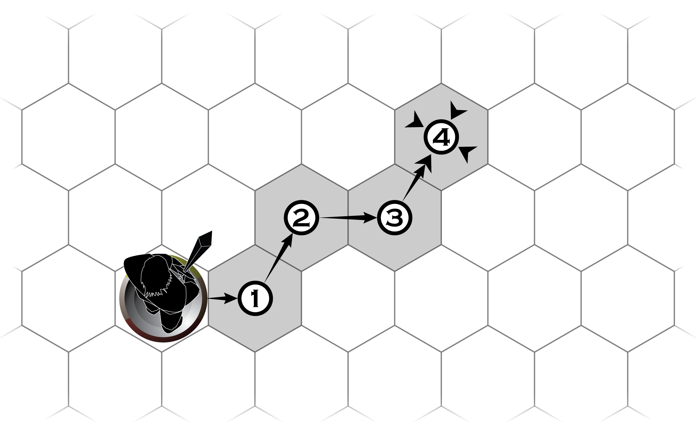

六边格地图被分割为一个个紧邻的六边形，每个六边形的边线与其他六边形的边线相接。一个六边格与其邻边的六边格之间距离为1步。测量距离时，统计两处间最短途径的六边格数量，即可得到步数。

与方格地图一样，占据六边格面积不足一半的物体与地形也应当被视作是艺术表现，以另一部分占据更大面积的地形或物体为准。同理，对于某些细节复杂的方格，请交由主持人判断。

### 无网格地图（Gridless Map）

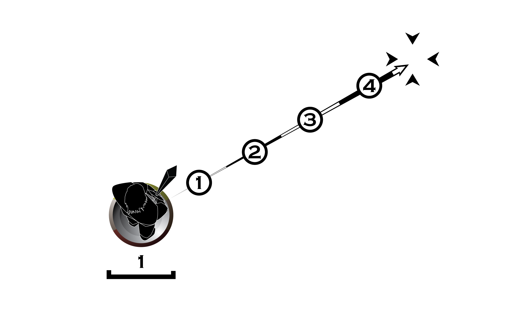

你也可以使用没有任何网格标记的地图进行游戏，此时一把卷尺将是非常有用的测量工具。在测距前，请约定一个中型生物的占位（通常是指示物的底盘直径）作为1步。测量距离时，用卷尺测量两处间的最短距离，并根据中型生物的直径得出两者间的距离步数。举例来说：以底盘直径为2厘米的模型作为中型生物的占位，通过卷尺测量得到两处间的最短距离为15厘米，那么两处间的距离为15厘米÷2厘米=7.5步，舍去小数为7步。

与使用其他地图进行游戏时一样，使用无网格地图游戏时若遇到复杂地形或物体，请交由主持人判断。

## 区域（Area）

某些攻击、能力作用或物品效果会作用于指定区域内的物体和生物，比如：施展寒霜力场、用霰弹枪攻击等。常见的区域类型包括射线、曲线、圆形、环形与扇形等。

若遇到复杂的区域形状，通常可交由主持人判断覆盖区域。为了避免陷入对区域的争论，不妨在进行判断时偏袒主动采取行动的一方，比如：玩家角色施展洞穿射线时，即使射线只擦到了敌人的小部分身体，也可将其视作有效；反之，当一名非玩家角色施展同样的能力时，也应以同样的方式偏袒这位非玩家角色。

### 射线（Ray）与曲线（Curve）

通常，射线/曲线自起始点向特定方向延伸，形成一条线，这条线途径的位置都将被它覆盖。

通常射线/曲线的宽度可被忽略，但会注明它们的长度。若额外注明了宽度，那么它将覆盖线条左右两侧的区域。

在不同的地图样式下，射线/曲线覆盖的区域也将略有不同。在下图中，将给出对应的示例：

- 方格地图中的射线区域
    
    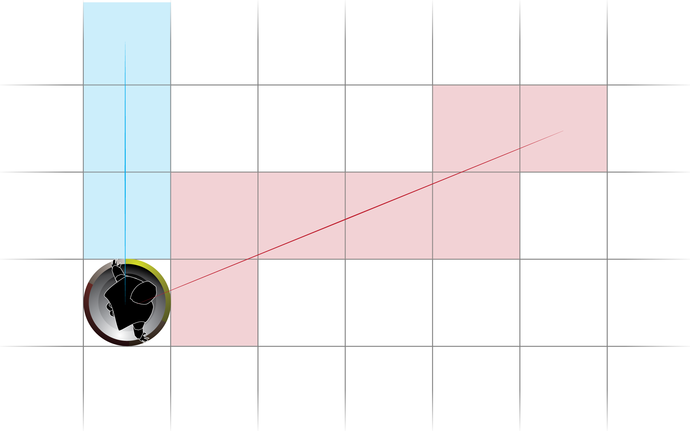
    
- 六边格地图中的射线区域
    
    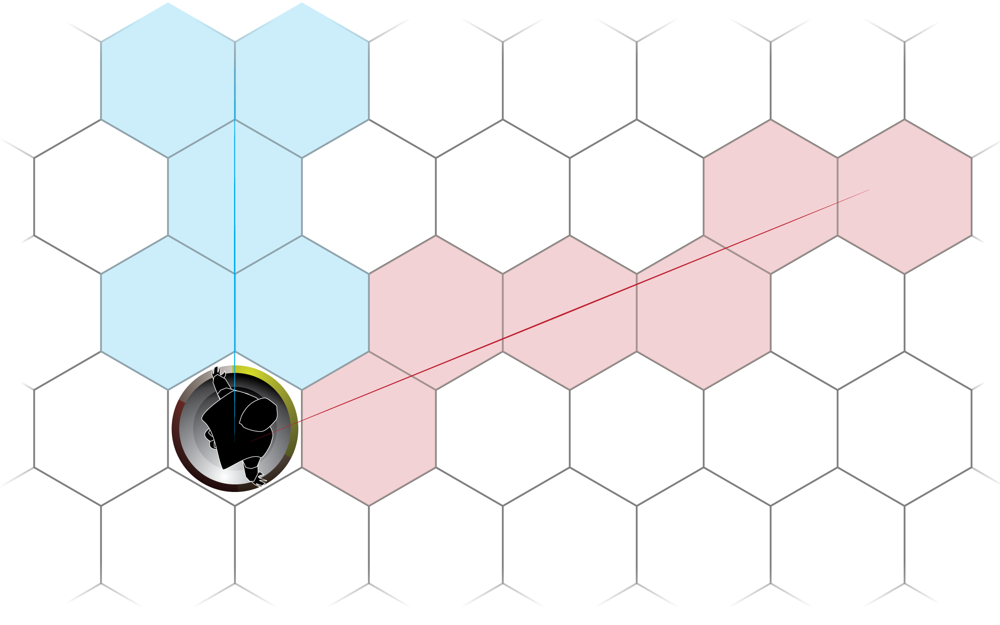
    
- 无网格地图中的射线区域
    
    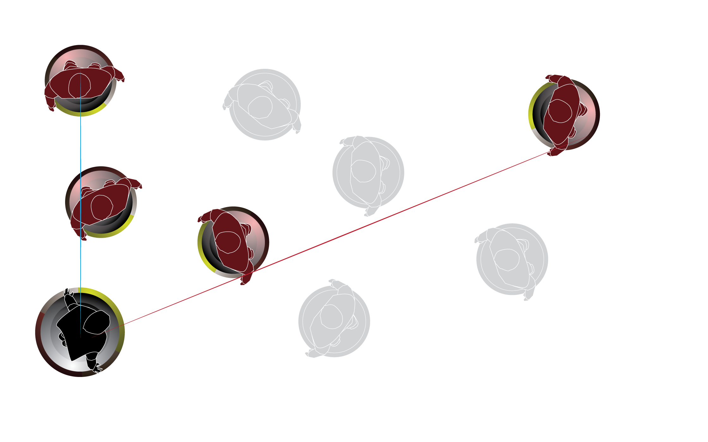
    
- 方格地图中的曲线区域
    
    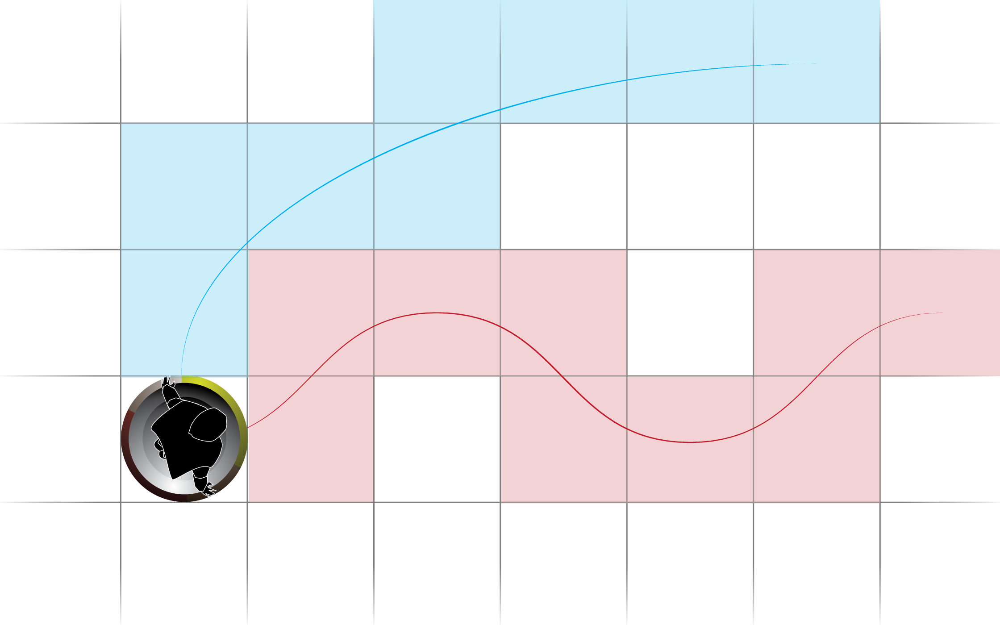
    
- 六边格地图中的曲线区域
    
    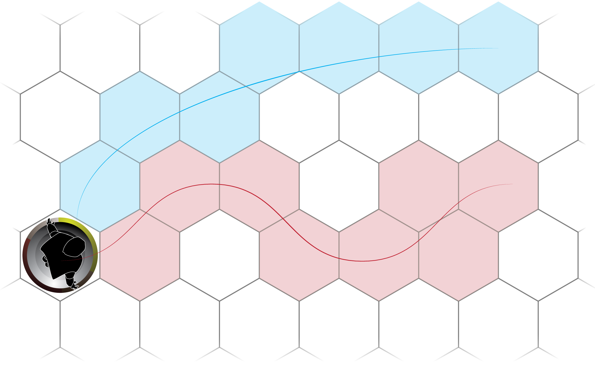
    
- 无网格地图中的射线区域
    
    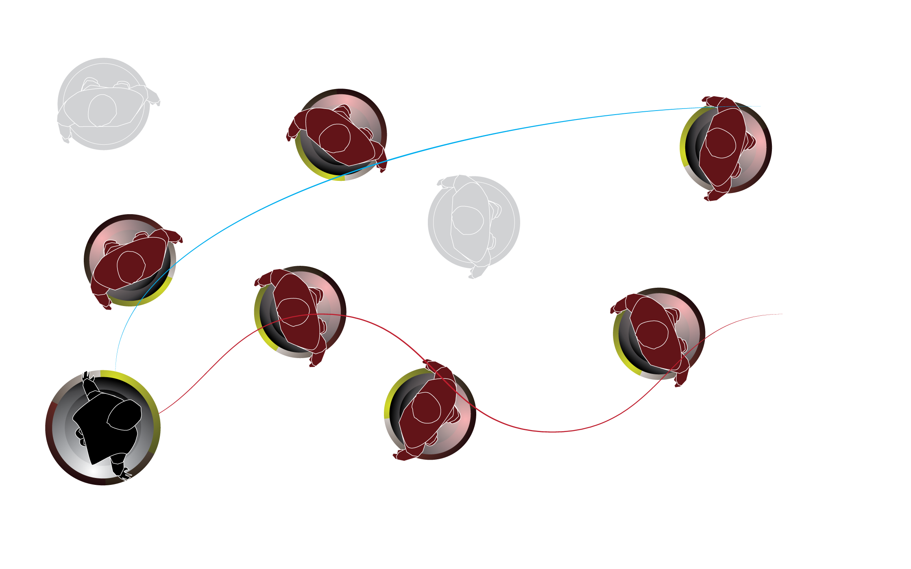
    

### 圆形（Disc）、扇形（Sector）与环形（Ring）

圆形、扇形和环形区域通常由起始点向周围扩张，扩张范围内的所有位置都将被其覆盖。

- 圆形区域将覆盖平面区域，通常会注明这片区域的直径或半径。
- 扇形可视为圆形的一部分，通常由两条射线形成夹角，并注明这片区域的长度和角度，它将覆盖夹角内的区域。
- 环形与圆形相似，但仅覆盖边缘位置（如同曲线）。圆环会注明它的直径或半径。通常环形的宽度可被忽略。但若额外注明了宽度，那么它将覆盖线条内外两侧的区域。

在不同的地图样式下，圆形、环形和扇形覆盖的区域也将略有不同。在下图中，将给出对应的示例：

- 方格地图中的圆形区域
    
    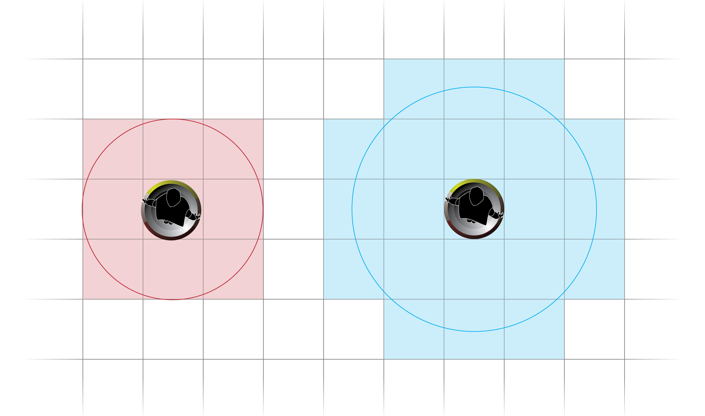
    
- 六边格地图中的圆形区域
    
    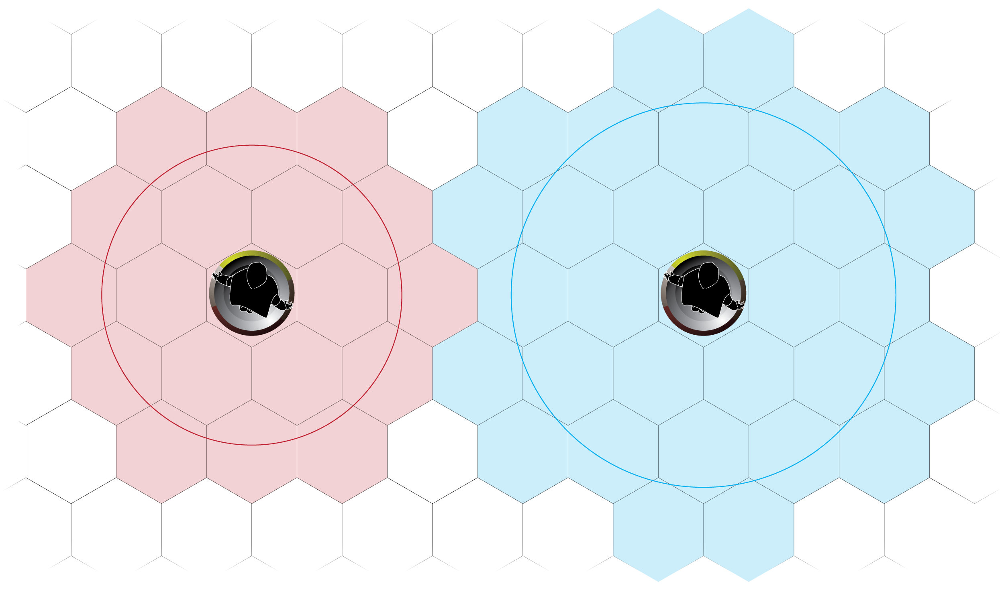
    
- 无网格地图中的圆形区域
    
    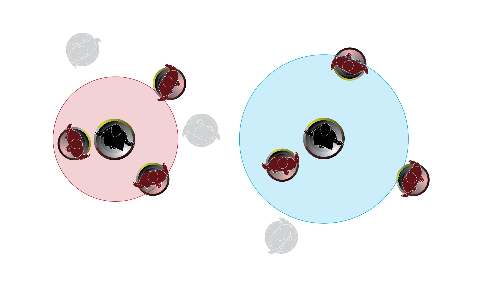
    
- 方格地图中的扇形区域
    
    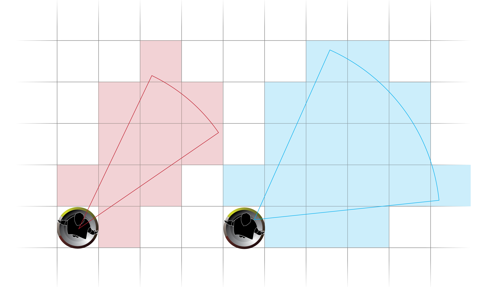
    
- 六边格地图中的扇形区域
    
    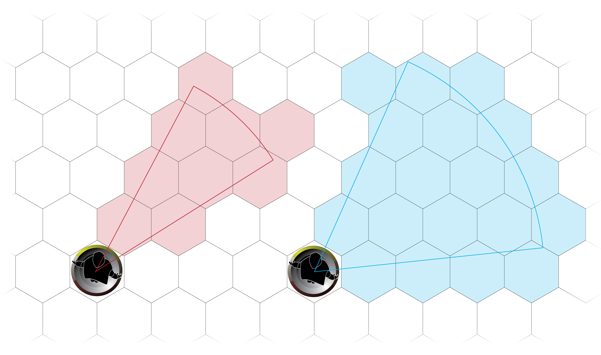
    
- 无网格地图中的扇形区域
    
    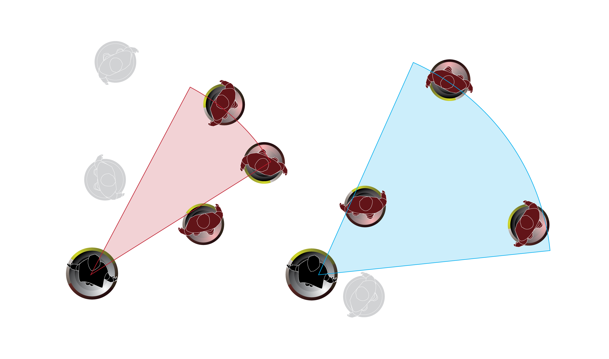
    
- 方格地图中的环形区域
    
    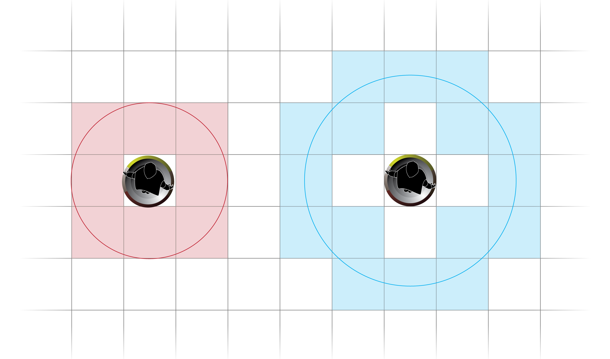
    
- 六边格地图中的环形区域
    
    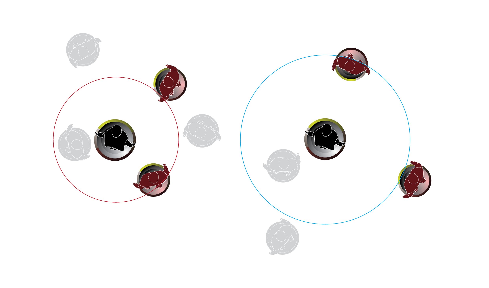
    
- 无网格地图中的环形区域
    
    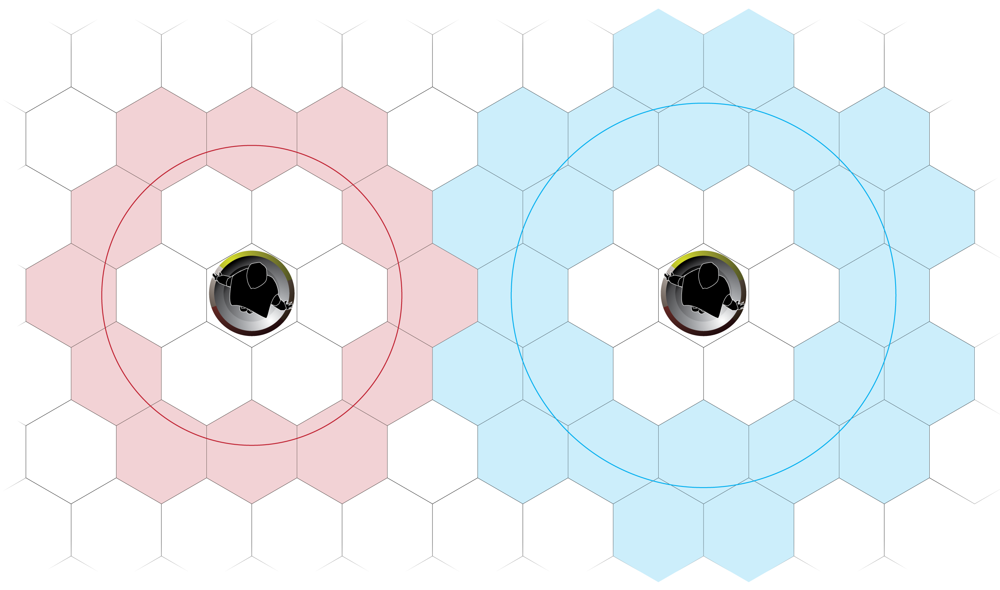
    

## [扩展] 方位（Position）

方位是指你与其他事物的相对位置。当采用方位规则时，你需要更多地考虑周遭事物与自己的位置关系，并尽可能避免将自己的后背暴露在敌人的面前。

- 朝向（Direction）
    
    你的角色朝向决定了周遭事物对于你的方位。使用指示物进行游戏时，指示物的朝向将作为方位的判断依据。在简述与叙事过程中，朝向通常可以被忽略，但在瞬息过程中，采用方位规则时应当重视这一要素：你可用0⚡️战术任意改变1次朝向，或是在1次主动移动后重新决定朝向；除此以外，你不能在自己的回合外改变朝向。
    
- 水平方位（Horizontal Position）
    
    水平方位是指同平面内的位置关系。通常你面朝方向的90°扇区被称作正面（Front）或前方（Frontage）；由正面向两侧延伸各90°的扇区被称作侧面（Flank），分别为左侧（Left Side）和右侧（Right Side）；与正面相反的90°扇区则被称作背面（Rear）或后方（Backside）——对于多数感知器官位于前方的生物而言，你无法感知到背面的事物，因此也无法防御来自背面的攻击。
    
- 垂直方位（Vertical Position）
    
    垂直方位是指高度上的位置关系。通常高于你头顶的空间被称作上方（Above）；低于头顶但高于腰腹的空间被称作等高（Accord）；低于腰腹的空间则被称作下方（Below）。
    

为了避免陷入对朝向和方位的无尽争论，不妨在进行判断时偏袒主动采取行动的一方，比如：玩家试图绕行至敌人的背后施展背刺时，即使玩家角色只有半个身子位于敌人的背后，也可将其视作符合条件；反之，当一名非玩家角色做出同样的行动时，也应以同样的方式偏袒这名非玩家角色。

## 感知（Perceiving）与潜藏（Lurking）

在生死攸关的战场上、危机四伏的冒险旅途中、唇枪舌剑的谈判中，提前发现危险与机遇，将使你更易抓住机会。而在对手发现自己之前隐藏行踪，将使你获得更多优势，甚至避开无意义的冲突和威胁。多数生物依赖五感来观察周围的环境、判断位置与距离、发现并规避危险。

- 发现（Spotting）
    
    通常，你能够发现所有位于感知范围内的事物（借助标注有“-”的感知方式时，感知范围÷2）。检查你能否发现某个目标时，在你与目标之间做一条假象的直线——若直线上没有阻挡感知的环境要素，那么你就能发现该目标。有时，复杂的地形环境可能会影响判断，适当忽略那些不显著的环境要素则可以加快游戏的进展。比如：当敌人位于一堵墙后的转角处只露出半个身子时，你也能发现这名敌人，反之亦然。
    
- 干扰感知（Interferring）
    
    身处弥漫的雾气中、在茂密的丛林中、在伸手不见五指的黑夜、身陷拥挤的人群中时，你的感知范围会遭到削减。当身陷这类环境中时，你的感知范围÷2；从这类环境之外向内观察时，你只能发现距边缘3步内的事物。
    
- 遮蔽（Blocking）与隐藏（Hiding）
    
    有许多因素可使你避开对手的感知，比如：躲藏在一张翻倒的桌子后、匍匐在草丛中、蜷缩在树木后等。请注意，一旦你脱离了这些遮挡感知的事物或效果，就会立即被对方发现，也将立即结束隐藏。
    
    - 如果两个生物间的体型等级差值≥2，那么较小的生物会被较大的生物遮蔽。
    - 若你未被某个生物发现，那么你对其所做的一切行动都可在掷骰时+2🅟。请注意：通常，一旦你做出威胁其他生物的行动，将立即暴露自己的行迹。
- 隐形（Invisibility）与伪装（Disguising）
    
    不同于借助地形环境进行隐藏，隐形将使你失去踪迹，伪装则可通过改换样貌藏匿自己。利用光学迷彩与周遭环境融为一体、以障眼法匿身阴影中、施展隐形魔法等，都可达成隐形或伪装的效果。通常，在隐形与伪装期间，即使你出现在对手的感知范围内也不会被发现。
    
    - 识破（Detecting）：某些隐形与伪装效果可通过仔细调查的方式识破。一旦被识破，隐形与伪装就失去了作用，你也将被对手发现。若一个隐形或伪装效果可被识破，将会注明识破它的难度。请注意，未做特别注明的隐形与伪装效果无法被识破。
    - 尽管你可在隐形期间消失不见，或是伪装成不起眼的物体，但仍会因行动带来的气流和声响、触碰周围物件等方式暴露自己的行踪。若在隐形或伪装时做出极不合理或过于夸张的行动，主持人完全可以认为你已被识破。
- 调查（Investigating）与搜索（Searching）
    
    多数情况下，你总是可以轻易地发现显而易见的事物，比如：一头野兽、一柄武器、一本书册……但那些不起眼的细节则可能在不经意间被忽略，比如：隐藏的敌人、野兽鬃毛中的血渍、武器锋刃上的缺口、书册中夹着的纸条等。调查与搜索可使你发现这些隐藏的事物、识破隐形与伪装、洞察不为人知的细节。这么做时，你需要声明调查与搜索的目标范围，然后掷精神骰🅟尝试是否发现了什么。
    
    - 通常，进行一次调查或搜索需用3⚡️战术。
    - 在进行调查或搜索时，你应当声明目标与范围，且越精确越好。比如：当你进入一间房间时，简单地询问“这间房间中有什么不同寻常之处”并不能为你带来有用的线索；但“检查那座墙角的烛台是否有什么特别之处”或“看看床底下有些什么”就非常合适。
    - 主持人可根据物体的尺寸或生物的体型、它们的掩藏程度来决定调查与搜索的难度。在掷骰判断结果时，为了避免透露过多的信息，主持人可以代替玩家进行暗掷。
    
    | 调查/搜索的对象 | 难度 |
    | --- | --- |
    | 琐碎物品或细小的物体、微型或更小体型的生物 | 3 |
    | 轻型物品或一般尺寸的物体、小型与中型生物 | 2 |
    | 重型物品或较大的物体、大型或更大体型的生物 | 1 |
    | 经过精心掩饰、刻意隐藏或与周遭环境融为一体的事物 | 难度×3 |
    | 被简单掩饰、与周围环境相似但仍可分辨出不同的事物 | 难度×2 |
    | 随意放置而未做刻意掩饰、稍加注意即可发现的事物 | 难度-1 |

## 移动（Moving）

在简述与叙事过程中，长途移动的距离和速度通常采用模糊描述的方式处理，比如：“花费一周左右来到位于百公里外的城堡”、“前行了大约十来步”。但在瞬息过程中，移动往往需要精确地进行判断。

通常，在瞬息过程中，你每次移动须用1⚡️战术，可移动最远等于移动速度的距离（以标注有“-”的方式移动时，移动速度减半）。每次移动时，你只能采用一种移动方式。举例来说：你需用1⚡️战术行走2步来到石壁前，再用1⚡️战术开始第二次移动进行攀爬，而不能仅用1⚡️战术先行走2步后再攀爬1步。

### 主动移动（Spontaneous Moving）与被迫移动（Forced Moving）

自愿或有意识地移动被称作主动移动，通常这类移动由你决定何时开始、以什么方式、经过何处并到达哪里。被迫移动则通常不受你的控制，比如：被其他生物拖动/推动或举起移动、被一次攻击击退等。你无法决定何时开始被迫移动，也无法决定移动的方式、路线和终点——它须由迫使你移动的一方决定。

- 请注意：如果移动速度降至0或更低，你将无法进行主动移动。
- [扩展] 若启用了方位规则，那么在一次主动移动后，你总是能重新决定自己的朝向。请注意，被迫移动后你无法自主改变朝向。
- 障碍（Obstruction）
    
    墙体、悬崖、树木、能量壁障等物体都可成为阻挡移动的障碍。被视作障碍的物体将阻挡你的移动，与你体型等级差距≤1级的生物（虚体生物除外）也会阻挡移动——你须在移动时绕开这些障碍或生物。
    
- 顺畅移动（Smooth Moving）与困难移动（Difficult Moving）
    
    顺流而下、下坡行路时视作顺畅移动，此时你每移动2步，仅相当于在平时移动1步；反之在崎岖不平的地面移动、沼泽和荆棘丛中穿行、逆流而上时视作困难移动，此时你每移动1步，相当于在平时移动2步。顺畅移动与困难移动对移动速度的影响可相互抵消，比如：沿崎岖的山路下坡时，你的移动速度将保持不变（崎岖地形视作困难移动、下坡视作顺畅移动，两者相互抵消）。
    

> 凯瑞达掌握移动方式行走、攀爬-、游泳-。这意味着他可用1⚡️战术在地面上移动最远3步，或是在水中游泳前行1步（3移动速度÷2不擅游泳=1.5，舍去小数为1步）。

当凯瑞达试图在湍急的水流中逆流而上时，他将无法移动（3移动速度÷2不擅游泳÷2困难移动=0.75，舍去小数位0步）。
> 

### 翻越（Crossing Over）和跃过（Leaping Over）

矮墙、陷坑等地形会阻挡你的移动，但你可以翻越或跃过这类障碍。翻越或跃过障碍时，也须耗费移动步数，障碍的高度和厚度都须计入移动步数：每跃过1步高的障碍，计作1步；每翻越1步厚的障碍，也须计作1步。

- 你最高可翻越或跃过高度≤活力骰÷2的障碍（单位为步）。

### 瞬移（Teleporting）

瞬移是一种通过质能转化、相位变换、次元穿梭等方式改变位置的特殊移动方式。在各个游戏世界中对瞬移的原理有着不同的解释，但通常都具有无视障碍阻挡（但目的地不应在障碍内）、不受环境影响的特点。

- 若未特别注明，连续瞬移（在1回合中多次瞬移，且两次瞬移之间没有其他战术行动）不会使你显出身形。在其他生物的感知中，你会直接出现在最终目的地。

### 拖动（Pulling）、推动（Pushing）和举起（Lifting）

你可以在拖动、推动或举起相邻的物体进行移动。在瞬息过程中，举起或放下一件物体需用3⚡️战术，拖动和推动则无需做出额外的行动。

- 你可以拖动、推动或举起的物体重量最多为强壮骰×30公斤；如果物体的重量≥强壮骰×10公斤，你的移动速度减半。
- 你也可以拖动、推动或举起一个相邻的昏迷生物（或是自愿接受这么做的生物），被拖动、推动或举起的生物将随你一同移动。你只能拖动或推动体型等级与你相同或更小的生物，且只能举起体型等级比你更小的生物。

### 击退（Knocking back）

某些情况下你可能会被强大的力量击退（比如：遭到猛踢），此时你会朝着造成击退的来源反方向移动，并将在遇到障碍时停下。

- 因被击退而移动视作一次被动移动，你无需做出行动，也不会花费机动。

### 下落（Falling）或坠落（Dropping）

你可能因失去平衡而从悬崖上跌落，或是从屋顶跃向地面。你将以每轮30步的速度下落（不足30步时视为下落1轮），直至接触到地面为止。除非你能够飞行或拥有类似的悬空效果，否则在下落过程中，你不能主动移动或控制自己的姿势。

- 通常，即使你能够飞行或具有类似的悬空效果，在下落过程中也须先用1⚡️应对此次下落才能稳住身形并控制姿势。

通常，你可以轻松应付落差小于活力骰的下落，并在落地时保持平衡。但若落差步数≥活力骰时，你就将遭到1次落差步数-活力骰🅟的物理攻击。

- [扩展] 启用姿势规则时，若此次下落导致的攻击命中，你将在落地时倒地，否则你可以任意决定落地后的姿势。

### 搭乘（Riding）

通过搭乘坐骑、车辆、船舶、飞行器等，你将以坐骑或载具的移动方式与其一起移动。为了搭乘坐骑与载具，你通常须先登上它们——这往往需要花费时间做出特定的行动，比如：骑上战马、进入驾驶室、钻入座舱等。反之，你也需要做出相应的行动脱离坐骑或载具。

如果坐骑或载具没有注明某种移动方式，那么搭乘时你也无法进行此移动。举例来说：即使你能够飞行，也不能使座下的战马飞起来。

- 某些坐骑或载具可为搭乘者提供保护，比如：战车、装甲船等。
- 驾驶（Piloting）
    
    某些坐骑与载具拥有宽敞的空间可供搭乘多个生物，比如：战象、卡车、商船等。通常，将由一名（或数名）具备特定能力的搭乘者负责控制坐骑与载具进行移动，包括决定目的地、改变方向等。在不同的坐骑或载具中，驾驭者的称呼可能不同，比如：战象的驾驭者被称作“驭手”、车辆的驾驭者被称作“司机”、飞机的驾驭者被称作“飞行员”。
    

> 战马的搭乘说明：
> 
> - 可搭乘中型生物×1、移动速度9（行走）、搭乘者在为防御掷骰时-3🅟，你需用6战术登上或脱离战马。
> - 搭乘时若被攻击命中，你需掷活力骰🅟尝试（难度等于伤害），若失败将从4步高处坠落。
> - 驾驭：由唯一的搭乘者驾驭。用1⚡️战术命令战马做出一次行动，如果前后两次命令相同（比如：命令战马连续行走），则无需为后一道命令花费机动。

### 旅行（Travelling）

旅行是指长距离的持续移动（比如：从一座城市前往另一座城市）。旅行往往发生在简述过程中，它包括持续移动、翻越障碍、进行休整等一系列行动。通常，你每小时最远可前行移动速度×1千米。根据不同的旅途环境，主持人也可对其做出调整，比如：途中遍布导致困难移动的泥泞路线时，你每小时最远只可前行移动速度÷2困难移动×1千米。

- 结伴旅行时，速度较快的旅行者往往须等待更慢的同行者。因此，在计算旅行距离时，应当根据速度最慢的旅行者决定。
- 急行（Rapid Marching）
    
    你可以移除属性骰来加快旅行速度，每小时你都可移除每种属性骰各1颗，从而在接下来的1小时中，使旅行距离×2。
    
- 日夜兼程（Forced Marching）
    
    通常，你每天可行进最多8小时，余下的时间须用于补给和休息。若你决定在一天中花费更多时间用于赶路，那么每超出1小时（不足1小时按1小时计），就将损失强壮骰、活力骰和精神骰各1颗。
    

搭乘坐骑或载具时，旅行的距离将以坐骑或载具的速度为准。搭乘坐骑进行急行或日夜兼程赶路时，将由坐骑承受属性骰的损失；搭乘无需人力操作的载具（比如：帆船、自动驾驶汽车）时，可全天24小时持续行进，但你也无法进行急行。

## [扩展] 姿势（Posing）

在纷飞炮火中卧倒、半蹲着发射武器、骑在战马上或是跌落摔成四仰八叉……这些都是姿势。在不同的局势和环境下选择合适的姿势，将为你赢得更多优势。

- 在瞬息过程中，每次主动变换姿势，你都须用1⚡️战术。
- 主动变换姿势时，你可以同时移动1步——此次移动被包含在变换姿势的行动中。请注意：被迫改变姿势时（比如受到蛮牛打击而倒地），你无法进行额外移动。

### 站立（Standing）

站立是最常见的姿势，也是你在日常活动时最常采取的姿势。

### 蹲伏（Crouching）与坐姿（Sitting）

蹲伏包括矮身低伏、屈膝跪下、半蹲或鞠躬，坐姿则往往依托于身下的支撑物（比如：座椅和坐骑）。

- 蹲伏时，你的移动速度÷2；而在采用坐姿时，通常都无法移动。

### 倒地（Knocked down）与卧倒（Proning）

在游戏中，你可能因失去平衡而摔倒，或是主动卧倒以躲避袭击。倒地或卧倒时，你的行动可能会有些不便。当然，这种姿势也使你缩减了暴露的面积。

- 卧倒或倒地时，你的移动速度÷3，且所有用活力骰的掷骰-2🅟。

# 攻与防

你时刻会在战斗和冒险时遭受来自敌人、陷阱和恶劣环境的攻击。攻击会削弱你的体能和意志，为你带来痛苦。攻击时，你需要掷骰来决定攻击的结果：决定是否命中，以及造成多少伤害。受击者也可以针对一次攻击进行防御，从而化解攻击的威胁。在本章中，将介绍如何处理攻击、判断一次攻击是否命中、如何防御攻击、以及计算攻击造成的伤害。

- 通常一次攻击的说明写作“对强壮造成3🅟物理攻击”、“对活力/精神造成精神骰🅟侵蚀/灵异攻击（可闪避/抵抗）”。在这些攻击的说明中，规定了它会对受击者的哪项属性造成伤害、攻击者须做怎样的掷骰和计算、受击者用哪种防护和防御手段抵消攻击的掷骰结果。
- 游戏礼仪：在进行攻击前，你应当告知受击者（其他玩家或主持人）这次攻击的必要信息：它将对何种属性造成伤害、攻击类型，以及可用哪种手段防御。以便受击者提供必要的防护数据、选择应对手段，并选择须移除的属性骰——这将大大加快游戏的节奏。

## 武器攻击

使用武器进行攻击是最常见也是最基本的攻击手段，挥舞手中的刀剑与棍棒、张弓拔弩发射箭矢、举枪射击或是操作火炮，这些都被视作武器攻击。武器攻击分为两种：近战攻击和远程攻击。如果一件物品可以作为武器，在它的说明中将会注明用于攻击时所需的行动、你需为攻击做出的掷骰、以及在攻击中的其他注意事项。

- 请注意：即使你装备了多件武器，每次也仅能选用其中一件进行一次武器攻击。
- 多数武器攻击都需用战术行动做出，但某些能力或特别设计的武器也可使你应对特定情况做出攻击。

---

- 近战攻击（Melee Attack）
    
    近战攻击通过接触目标造成杀伤，比如：拳脚打击、刀斧劈砍、棍棒敲打、长矛穿刺、软鞭挥甩等，武器将作为肢体的延伸。
    
- 远程攻击（Ranged Attack）
    
    远程攻击通常以挥动软武器、发射飞弹与射线，或隔空攻击的方式对远处目标造成杀伤，比如：挥舞长鞭、投射飞镖和标枪、发射箭矢和子弹、使用激光照射等。
    
    若一件武器的攻击说明中注有“丢掷”，就表示你须将其掷出以攻击远处的目标。通常，被丢掷出去的武器将会消耗掉。
    

---

- 攻击范围（Reach）
    
    攻击范围包括近战攻击的触及距离和远程攻击的射程。武器攻击的目标须在范围内，比如：“对1个相邻生物攻击”、“对9~30步内1个生物攻击”等，详见前文的距离规则。多数攻击范围都以“步”作为距离单位，某些武器则具有超远的攻击范围，以更长的尺度（比如：千米）作为距离单位。某些武器的攻击范围须指定一片区域（比如：一片直径3步的地面、最远6步的30°锥形区域），这类攻击将会覆盖区域内的所有目标；另一些武器会限定它的最近攻击距离，比如：长鞭的攻击距离为“3~6步”，这表示你可以用长鞭攻击3步之外、6步之内的目标——如果受击者距你过近，那么为攻击掷骰时减少3颗骰子。
    
- [扩展] 超距攻击（Overreach Attack）
    
    在远程攻击时，你可以勉强攻击超出攻击范围外的目标。通常，每超出射程1倍，为远程攻击的掷骰减少2颗骰子。
    
- 某些武器可将弹药发射出去或是转换为能量造成杀伤，这类武器通常须消耗特定的弹药，并会继承弹药的攻击效果，比如：长弓、转轮手枪、水晶腕炮等。使用此类武器攻击时。

## 为攻击掷骰

作为攻击者，你须为每次攻击掷骰来决定是否击中目标，并根据这次掷骰的结果计算攻击造成的伤害。通常，每次攻击的说明中都规定了你的掷骰数量，比如“强壮骰🅟”、“活力骰+3🅟”、“活力骰/精神骰孰高🅟”或“3🅽”等。你须依照攻击的说明掷出指定数量的骰子，从而得到这次攻击掷骰的结果。

- 如果攻击掷骰的结果为0，那么这次攻击将直接视作未命中，同时也代表这次攻击无需进行后续的处理，立即结束。
- 与所有掷骰一样，若你的掷骰颗数≤0颗，就意味着此次攻击掷骰的结果必然为0。
- 多段攻击（Multiple Attacks）
    
    某些攻击中包含了数段攻击，比如：你可用匕首对1个相邻生物的强壮造成2段活力骰÷2🅟物理攻共计（可格挡/闪避）——这表示用匕首进行攻击时，你须分别为每段攻击分别掷骰，受击者也可对每段攻击分别做出应对。
    
    多段攻击被视作一次整体攻击，因此作用于“1次攻击”的效果将同时作用于每段攻击；如果你的攻击额外增加了骰子，那么每段攻击都将增加等量的骰子，反之减少骰子的效果也是如此（只为某次掷骰增减骰子的情形则不在此列，因为其影响的是某次掷骰而非攻击）。值得注意的是：若一次攻击未提及段数，那么这次攻击总是视作“1段攻击”。
    

## 攻击类型与防护减免

攻击类型决定了一次攻击将通过何种形式造成伤害，也决定了受击者该用哪项防护来抵消攻击的伤害。为攻击掷骰后，你应当根据攻击类型，将掷骰的结果减去受击者对应的防护。常见的攻击有三种类型，对应这些攻击类型，分别有三项防护减免攻击：物理防护减免物理攻击、侵蚀防护减免侵蚀攻击、灵异防护减免灵异攻击。每1点防护可减免1点掷骰的结果。

- 如果用于减免攻击的防护本就小于0，意味着这是你的弱点：此时非但不能减免攻击掷骰，反而会使攻击掷骰的结果增加。不过，如果攻击掷骰的结果本就为0，那么无论你的防护有多低，攻击掷骰的结果也应视为0，此次攻击不会对你造成威胁。
    
    > 瓦雷的侵蚀防护为-1。当瓦雷遭到1次掷骰结果为2的侵蚀攻击时，他将受到2攻击掷骰点数-（-1侵蚀防护）=3点伤害，负数的侵蚀防护反而会增加他受到的伤害。
    
    在另一次战斗中，瓦雷再度受到侵蚀攻击，但这次攻击的掷骰结果为0。尽管他的侵蚀防护为负数，但因为攻击掷骰本就为0，所以此次攻击没有命中瓦雷，他也没有受到任何伤害。
    > 
- 穿透防护（Penetration）
    
    攻击说明中包含如”穿透1防护“的说明，意味着它会无视受击者的部分防护。为一次能够穿透防护的攻击计算结果时，可忽略等于穿透数量的防护。如果有多个穿透效果作用于一次攻击，这些穿透效果的数额将会累加。
    
    请注意：在计算时，防护不会因穿透而降至0以下。举例来说：若某项防护为1，遭到穿透3防护的攻击时，防护视作0（而非-2）。同理，如果受击者的对应防护本就小于0，穿透防护并不会使其变得更低。
    
    > 阿丹手持一把战斧对野猪进行一次攻击。战斧的攻击说明为“对强壮造成强壮骰🅟物理攻击，穿透2防护（可格挡/闪避）”。阿丹掷骰得到2点数，野猪的物理防护为3，凭着战斧的穿透，这次攻击对野猪的强壮造成了2攻击掷骰点数-（3物理防护-2穿透）=1点伤害，这次攻击命中了野猪。
    
    在另一场战斗中，阿丹同样用这把战斧对一名野蛮人术士进行攻击，他掷骰得到1点。野蛮人术士的物理防护为1，战斧的穿透防护最多只能将野蛮人术士的防护降至0，因此这次攻击对野蛮人术士的强壮造成了1攻击掷骰点数-（1物理防护-2穿透，最低降至0）=1点伤害，这次攻击也命中了野蛮人术士。
    > 

在游戏中，常见的攻击被归纳为物理攻击、侵蚀攻击和灵异攻击三种类型，它们分别可用三种防护来减免；在某些特殊情况下，你也可能遭受到无法防护的真实攻击。

- 混合攻击（Multi-types Attack）
    
    某些攻击可能同时具有多种攻击类型（比如：6🅟侵蚀/灵异攻击），遭受此类攻击时，受击者须用对应防护中较低的那项抵消此次攻击造成的伤害。
    

### 物理攻击（Physical Attack）

物理攻击通过实体接触、动能传递等方式造成伤害。在不同游戏世界中，造成物理攻击的手段也有所不同，比如：在奇幻世界中的刀剑劈砍、棍棒敲打；在武侠世界中的兵器打击、外家拳脚；在现代世界中的实弹射击、电锯切割；在科幻世界中的震波、重力压迫等。

- 遭受物理攻击时，你可以用物理防护减免物理攻击的掷骰结果。

### 侵蚀攻击（Erosive Attack）

侵蚀攻击包括能量辐射、微粒渗透、药物和微生物等方式造成伤害。在不同游戏世界中，造成侵蚀攻击的手段也有所不同，比如：在奇幻世界中的火焰灼烧、疫病与毒素；在武侠世界中的蛊术毒药、内力侵体；在现代世界中的电击和辐射、酸液腐蚀；在科幻世界中的光束与微波、生化武器等。

- 遭受侵蚀攻击时，你可以用侵蚀防护减免侵蚀攻击的掷骰结果。

### 灵异攻击（Occult Attack）

灵异攻击通过心理暗示、幻觉、颠覆常识、超自然力量等方式造成伤害。在不同游戏世界中，造成灵异攻击的手段也有所不同，比如：在奇幻世界中的诅咒降头、催眠和幻术；在武侠世界中的琴瑟魔音、奇门术法；在现代世界中的催眠暗示、恫吓刺激；在科幻世界中的神经干扰、意识剥夺等。

- 遭受灵异攻击时，你可以用灵异防护减免灵异攻击的掷骰结果。

### 真实攻击（Raw Attack）

真实攻击是一种特殊的攻击类型，它直接作用于受击者的存在本质，诸如通过神威否定受击者的存在、抹除受击者的灵魂等方式造成伤害。

- 真实攻击以最接近本源的方式作用于受击者，是一种纯粹的攻击，因此无法通过任何防护减免它的掷骰结果。

## 防御

遭受攻击时，受击者可以选择用防御应对此次攻击，从而减免攻击的威胁。在攻击说明中会注明可用哪种防御手段应对，比如：“可格挡”、“可闪避”或“可抵抗”。你可以选择防御：为这次防御掷骰并用点数减免攻击掷骰的结果。某些攻击可用多种防御手段应对，比如：“可闪避/抵抗”，这表示你可以从中选择一种防御手段。在游戏中共有格挡、闪避和抵抗三种防御手段，但你只能对一次攻击进行一次防御，一旦你选择了一种防御手段，就无法再用其他手段防御同一次攻击了（遭到多段攻击时，你可以对每段攻击分别做出防御）。

### 格挡（Parrying）

你可以用盾牌阻挡来袭的武器、用武器招架或拨开攻击，或是用力量与对手抗衡，使攻击失去威胁。

- 用1⚡️应对攻击：你可以掷强壮骰🅟来减免伤害（如果强壮是无效属性，则掷3🅟）。

### 闪避（Evading）

你巧妙地预估攻击的路线，然后借助灵敏的步伐进行小步挪腾、扭曲肢体，从而避开来袭的攻击。

- 用1⚡️应对攻击：你可以掷活力骰🅟来减免伤害（如果活力是无效属性，则掷3🅟）。

### 抵抗（Resisting）

你通过坚定的心神与意志抵御幻象与错觉，或是调集超自然力量进行干扰与中和，从而瓦解攻击的危害。

- 用1⚡️应对攻击：你可以掷精神骰🅟来减免伤害（如果精神是无效属性，则掷3🅟）。

---

- 防护减免与防御掷骰的结果应当累加在一起，用计算之和共同减免攻击掷骰的结果。
- 受击者可在攻击掷骰得到结果后再决定是否防御。因此，如果一次攻击不足以构成威胁（比如足以被你的防护减免至0），你可以无视这次攻击。
- 完全防御（Solid Defended）
    
    若在防御时，攻击掷骰的结果被减免至0，这次防御就被称作完全防御。请注意：如果攻击掷骰的结果本就为0，或是防护减免已将其降至0，那么即使你进行防御，也不应视作完全防御。
    
- 如果一次攻击未写明可用的防御手段，那就意味着这次攻击无法被防御。
- 如果你不曾发现攻击者，那么你无法防御这次攻击。

> 崔妮蒂遭到一头恶狼的啃咬，她的强壮将受到4🅟物理攻击（可格挡/闪避）。恶狼的攻击掷骰得到3点，崔妮蒂的物理防护仅有1，这一击足以令她重伤，所以她决定进行防御。崔妮蒂有3颗强壮骰和6颗活力骰。她决定用1⚡️进行更有胜算的闪避：她掷出6颗活力骰得到2点，这次闪避使攻击造成的伤害降为3攻击掷骰结果-1物理防护-2闪避点数=0——因此，崔妮蒂灵巧地闪身侧让，成功避开了恶狼的啃咬，并且做到了完全防御。
> 

## 命中（Hit）、未命中（Missed）与造成伤害（Dealing Damage）

如果攻击掷骰经过防护与防御的减免后结果仍然大于0，就意味着这次攻击命中了受击者。一旦命中，这次攻击就将对受击者造成伤害。反之，若最终结果小于或等于0，就意味着这次攻击未命中——这次攻击被抵挡了，或是被坚固的防护抵消了。

- 如果一次攻击掷骰的结果本就为0，那么这次攻击一定不会命中。

---

一旦攻击命中，就应当为这次攻击计算伤害。通常攻击掷骰经过防护与防御减免后的结果，就是这次攻击造成伤害的数量。受击者须根据攻击说明移除属性骰，每1点伤害都须移除1颗对应属性骰。

在一次攻击的说明中，会注明它会对哪项属性造成伤害。对强壮的攻击须移除强壮骰、对活力的攻击须移除活力骰、对精神的攻击须移除精神骰。如果一次攻击可对多项属性造成伤害，比如：“对强壮/活力攻击”、“对活力/精神攻击”，那么受击者可在提及的属性中自行分配移除的属性骰。

- 额外伤害（Additional Damage）
    
    某些攻击在命中后将造成额外的伤害，比如：“造成伤害+1”、“造成伤害+2🅟”或“造成伤害×2”，这表示若此次攻击命中，在计算伤害时须增加指定的数额。某些攻击可能减少最终造成的伤害，比如：“造成伤害-1”，这表示在计算最终伤害时，须减去指定数量的伤害（最低减少至0）。遇到如“造成伤害×3”或“造成伤害÷2”的说明时，应当先用攻击掷骰的结果减去受击者的防护与防御点数，再为此结果计算倍数。请注意：若一次攻击未命中，那么无论有多少额外伤害，都不会造成伤害。
    

# 生与死

生存与死亡是一道永恒的命题，在游戏世界中，你的角色随时可能遭受危险，你可能因为伤势过重陷入昏迷濒死，或是因为各种原因面临最终归宿。在本章节中，将介绍有关这些生死之事的规则。

## 昏迷（Unconsciousness）与死亡（Death）

当你的任意一项属性骰被全部移除，你就将立即陷入昏迷。处于昏迷中的你无法做出任何行动，也无法获知周遭发生的一切：你不能与外界沟通、不能主动移动、无法防御攻击（只能依靠自己的防护减免攻击）、不能施展能力（但被动能力依然起作用），也不能使用或装备物品。简言之，在昏迷时你失去了对角色的控制权，且随时处于死亡的边缘。

- 陷入昏迷将使你立即倒地，你依然拥有与清醒时相同的防护，也会因受到伤害而继续损失其他属性骰；当然，你也可因各类能力或物品的作用恢复属性骰——当你的各项属性骰数量都达到1颗或更多后，就会立即结束昏迷。
- 昏迷时，你会在简述与叙事过程中自动进行休息，借此缓慢地恢复损失的属性骰（请查阅后文的休息规则）。
- 请注意：尽管在昏迷时你什么都做不了，但是在瞬息过程中你依然拥有自己的回合——那些在回合开始或结束时生效的能力作用、物品效果或是周遭环境的效果仍然会在对应的时机起效。

死亡则是大多数生命的最终归宿，在险象环生的游戏世界中更是司空见惯。你可能被一头噬人巨鳄吞进肚子、被一梭子弹打得身首异处、也可能被不知名的疫菌侵噬得只剩白骨，甚至只是无情岁月带走了你的生机。在游戏中，你或许时刻会面对死亡的威胁，它的坏处也显而易见：即便有再多的梦想和执念，你也什么都做不成了。在游戏中死亡也意味着你失去了自己的角色，与曾经的伙伴、敌人、财富或是恩怨生死两隔。除了最为常见的因损失属性骰而死亡外，你也会因遭受致命一击而死亡，或只是因为敌不过时间而寿终正寝。另外，某些致命的陷阱、诡异的魔法效果、高超的科技手段也可能使一个生物立即死亡。

- 若你失去了三项属性中的所有属性骰，那么你就将因伤势过重或体能衰竭而死亡。
- [扩展] 致命一击（Coup de Grâce）
    
    你可以声明对昏迷中的生物做出致命一击。致命一击可以是任何形式的攻击，只要命中昏迷的敌人就会使其死亡。通常，战斗的胜利者总是会在战斗结束后对所有昏迷的敌人做出致命一击——除非主持人或玩家另有打算。
    
- [扩展] 寿终正寝（Natural Death）
    
    本规则应当随年龄一齐启用。随着岁月流逝，多数生物都终将老去，并在生命的最后一刻安详离世。通常，寿终正寝的死亡是不可逆转的，很少有魔法或技术能够复活一个寿终正寝的生物。一旦你进入老年，每天开始时你都须掷出所有属性骰🅟进行尝试（难度为你进入老年的年数），尝试失败就将死亡。
    
- 复活（Reviving）
    
    某些强大的魔法或先进的技术可将已死亡的生物复活，比如：重生魔法、重塑身躯的医疗舱、将意识移植至克隆躯体等——你将能借助这些手段死而复生。但切勿期盼自己总会如此幸运，请珍视自己的生命。
    

## 休息（Resting）

在经历了命悬一线的战斗、虚与委蛇的交际，或只是一天平凡的劳作后，休息就显得尤为重要。休息时，你需要补充体液和养分，让躯体放松来愈合伤口和缓解病痛；同时，你也将在此期间养护装备、装填弹药或为物品充能。休息往往发生在简述或叙事过程中，一旦进入紧张的瞬息过程，就会中断休息——你必须全神贯注于眼前的难题与挑战，因此无法从容地进行休息。

- 通常，你总是会在休息期间完成装填和充能。因此除非主持人刻意安排，否则在下一场遭遇到来前，你总是做好了这些准备。
- 休息时，各项遭受损失的属性骰都将随着时间流逝慢慢恢复：每休息满1小时，你就可分别为各项受损属性掷出属性骰🅟，并恢复等于掷骰点数的属性骰。请注意：与一般掷骰不同的是，即使属性骰降至0颗，你仍可掷出1颗用于恢复属性骰。
- 充分休息（Full Resting）
    
    如果在一次休息后你恢复了全部属性骰，这次休息就被称作充分休息。如果启用了补给规则，那么你需要至少在休息期间分别进行一次进食、饮水和睡眠，才可视作充分休息。
    

## [扩展] 补给（Replenishing）

补给是指休息期间所做的必要事务，通常有三种：进食、饮水和睡眠。请注意：除非特别注明（比如：圣俑无需睡眠），若在休息期间缺少任何一项补给，此次休息都不能视为充分休息。

### 进食（Feeding）

你需要消耗食物来维持体能。通常，你每天最少需要的食物数量取决于你的体型：小型生物需1份食物、中型生物需2份食物、大型生物需4份食物。若一天中进食的食物少于该数量，你就将陷入饥饿。

### 饮水（Drinking）

你需要消耗饮料来补充流失的水分。通常，你每天最少需要的饮料数量取决于你的体型：小型生物需1份饮料、中型生物需2份饮料、大型生物需4份饮料。若一天中饮用的饮料少于该数量，你就将陷入干渴。

### 睡眠（Sleeping）

不同于进食和饮水，睡眠无需消耗物品。睡眠时，你的身体活性会下降、感觉会迟钝、躯体将进行自我修复。通常，你每天最少需保证累计睡眠6小时。若一天中的睡眠时长小于6小时，你就将陷入困乏。

- 在睡眠时，你无法感知外界的事物，也不能做出任何主动行动。
- 苏醒（Waking up）
    
    通常你可以自行决定醒来的时机，若你持续睡眠满6小时，就能够快速地自然苏醒。自然苏醒往往发生在简述或叙事过程中。若你在睡眠时进入瞬息过程（比如：在睡梦中遭到攻击）或受到外界刺激（比如：轰鸣的巨响、突如其来的地震等），你也将立即苏醒——但这会使你失去自己的首个回合，你的先手将视作在所有生物之后，且瞬息过程结束前你的任何掷骰都须减少2颗骰子。
    

如果你在某一天中缺少足够的补给，就会因此陷入不利境地——你将在次日开始时损失属性骰，这一影响甚至足以致命：若因此损失了某项属性中的所有属性骰，你就将陷入昏迷；同理，若你因此损失了所有属性中的全部属性骰，就将因体能衰竭而死亡。通常，这些损失的属性骰无法通过其他手段恢复，你往往只能通过充分休息逐步恢复它们。

- 饥饿（Hunger）
    
    若你在一天中没有进行足够的进食，就将感到饥饿。每缺少进食1天，你就会损失1颗强壮骰。在每次充分休息后，你可以恢复1颗因饥饿而损失的强壮骰。
    
- 干渴（Thirst）
    
    若你在一天中没有进行足够的饮水，就将感到干渴。每缺少饮水1天，你就会损失1颗活力骰。在每次充分休息后，你可以恢复1颗因干渴而损失的活力骰。
    
- 困乏（Exhaustion）
    
    若你在一天中没有进行足够的睡眠，就将感到困乏。每缺少睡眠1天，你就会损失1颗精神骰。在每次充分休息后，你可以恢复1颗因困乏而损失的精神骰。
    

# 主持战斗

在Meshal Lite的游戏中，激烈的战斗随时都可能发生：在狭小的黑巷中遭遇一群街头混混、在野外狩猎游荡的猛兽、或是在敌后阵地杀出一条血路……作为游戏的主持人，你将为每场战斗安排敌人（以及盟友）并扮演这些生物与玩家角色们作战，在玩家角色们获得胜利后，还须为其计算奖励。

尽管主持人须操控非玩家角色作为玩家的敌人，但推动游戏进程远比击败玩家更重要——比起征服甚至失去你的朋友们，与他们共同谱写精彩的冒险篇章显然更有意义。

## 战斗强度（Combat Intensity）

一场爽快的屠戮战会令人感受到自己的实力强大，但千篇一律的扫荡怪物只会让冒险变得索然无味；一场艰难的挑战会令人感到血脉贲张，但时刻处于濒死绝境的战斗终会令人疲于应付，却无法体会到战斗之外的游戏乐趣。精彩纷呈的冒险往往由跌宕起伏的战斗组成，这其中通常有许多场势均力敌的战斗、几场命悬一线的艰巨挑战、偶尔也不乏一些能被轻松击溃的拦路小鬼。此时，主持人需要计算战斗双方的实力，从而计算出一场战斗的强度。战斗强度有助于主持人直观地衡量一场战斗有多困难，同时也决定玩家角色们在赢得胜利后得到多少潜能奖励。

### 衡量战斗强度

每个生物都会注明它的实力——主持人应当遵循下述步骤进行计算，并根据计算的结果衡量一场战斗的强度：

1. 计算敌方实力：将所有参战敌对生物的实力相加。
2. 计算玩家实力：将所有参战玩家角色（以及友善生物）的实力相加。
3. 计算实力差距：用敌方实力减去玩家实力，然后除以参战玩家（以及友善生物）的数量。

| 战斗强度 | 实力差距 | 潜能奖励 | 说明 |
| --- | --- | --- | --- |
| 轻松（Easy） | < -30 | 0 | 这场战斗显然只是热身而已，或者说，它根本称不上一场战斗。 |
| 简单（Basic） | -30 ~ -1 | 1 | 这场战斗很是稀松平常——只要不犯下致命的错误，就能够轻而易举地获胜。 |
| 均势（Rival） | 0 ~ 29 | 2 | 这场战斗双方实力难分伯仲，很难说鹿死谁手。 |
| 棘手（Messy） | 30 ~ 59 | 3 | 这是一场略显困难的战斗，敌人略显强大，对于玩家来说并不容易。 |
| 艰巨（Tough） | 60 ~ 89 | 6 | 这是一场艰苦的战斗——若想取胜，需要谨慎地制定战术，且小心应对敌人的行动。 |
| 绝望（Desperate） | ≥ 90 | 12 | 这场战斗显得令人绝望，除非幸运女神亲临，否则毫无胜算。 |

## 胜利（Winning）

赢得胜利是多数战斗或争斗的目标。通常，从玩家的角度来看，活下去并且战胜敌人就是最基本的胜利。当一场战斗中所有敌对生物都陷入昏迷或死亡时，你就赢得了胜利。但是复杂的现实并不总能单纯地依照一条规则机械地进行判断，许多情况下，达成战术目标也意味着胜利（比如：坚守桥头堡防止敌人通行，直至援军到来；击杀关键的人物，然后逃脱敌人的追捕）。

- 根据主持人对游戏剧情的安排，w们可以通过达成特定的游戏目标来赢得胜利，比如：坚守桥头堡防止敌人通行直至援军到来、击杀关键的人物并逃脱敌人的追捕。
- 根据主持人对游戏剧情的安排，玩家们可以通过达成特定的游戏目标来赢得胜利，比如：坚守桥头堡防止敌人通行直至援军到来、击杀关键的人物并逃脱敌人的追捕。
- 通常在获得胜利后，每位玩家角色将根据此次战斗的强度获得潜能奖励，同时还将有机会从战败的敌人处获得战利品。

### 潜能奖励

当在一场战斗中获得胜利时，玩家角色就将从中获得体悟与经验的积累，它将作为潜能成为玩家角色的一部分。越是艰难的战斗，从中获得的潜能奖励也就越多（详见上表）。

- 请注意，通常只有未在战斗中逃跑、昏迷或死亡的玩家角色才能获得潜能奖励。
- [扩展] 主持人也有权为某位甚至全体玩家奖励额外的潜能，比如：玩家在战斗中采用了别出心裁的战术、展露出特别符合角色个性的特点等。凡是值得鼓励的行为，主持人都可给予更多潜能作为对这些行为的肯定。通常来说，额外奖励的潜能数额应当控制在1~3之间，最多不应超过战斗本身获得的潜能奖励。

### 战利品（Loots）

当一场战斗结束后，幸存者们将有机会从昏迷或死亡的生物处搜刮战利品。战利品通常包括两种来源：来自该生物装备和携带的物品，以及通过其他手段获取的额外战利品（比如：施展猎物加工从狼的身上获取生肉和皮毛），但无论怎样，每个生物的每项战利品都只可搜刮一次。

- 在生物的资料中，将注明有该生物装备和携带的物品。通常，在搜刮这类生物的战利品时，你总是能直接发现这些物品，且可以直接拾取它们（天生武器与天生防具除外）。当然，若某个生物在先前的行动中消耗或销毁了某件物品（比如：用短弓进行攻击时消耗了箭支），那么主持人也须从战利品中扣除。
- 满足特定条件的玩家角色还可额外获得更多物品，这类战利品也将在生物的资料内注明，写作如：“猎物加工（1小时）：毛皮×3（难度3）”，在此例中，若你掌握猎物加工能力，便可用1小时对其进行额外的处理，并将在尝试成功后获得毛皮×3。
- 随机战利品（Random Loots）：在某些生物的资料中，会写有随机战利品的说明，它表示该生物可能携带的战利品。处理这类随机战利品时，主持人需根据随机战利品的说明进行掷骰，并根据掷骰结果查阅表格，从中决定与掷骰结果对应的战利品。

> 在一场战斗结束后，玩家们开始搜刮战利品。在某个死去敌人资料中，有一条随机战利品的说明：“掷2🅽，结果为2~4时无战利品、5~9时获得初级治疗药剂×1、10~12时获得冷青石吊坠×1”。主持人暗掷2颗骰子，得到骰面结果7，所以此次玩家们从该敌人身上得到了初级治疗药剂×1。
> 

## 失败（Losing）

通常，当玩家角色们无力继续进行战斗时（比如：当你和所有伙伴都陷入昏迷或死亡），战斗就将以失败告终。根据主持人的判断，在特定情况下也可能导致战斗的失败，比如：护送的重要角色被击杀、重要据点的失守、在战斗中撤退等。胜败乃兵家常事，在错综复杂的战场上，胜负并非总是界限清晰，失败也并非无法容忍。很多时候，失败是通向成功的基石，经历失败才能获得成长。

请时刻记得，这是一个主持人与玩家们共同创造冒险奇遇的游戏。因此，在战斗中失败很可能是一场新冒险的开端：越狱与突出敌营、在绝境中挣扎求生、在苦役营中掀起暴动……一切取决于玩家们的想象力和主持人的剧情安排。

### 逃跑（Fleeing）与追杀（Chasing）

在战斗中，不仅需要勇气，也需要智慧。当遇到不利的情势时，选择逃跑并不可耻。逃跑可使你保存实力，从而调整战术或纠集援手。若是决定逃跑，你须确保至少连续3轮不被敌对生物的攻击命中，然后用3⚡️战术掷活力骰🅟尝试逃跑（难度为所有敌对生物活力骰数量孰高），若成功你将结束战斗并远离战场（主持人须将逃跑者移出战斗区域）。

- 成功逃跑后，直至此次瞬息过程结束之前你都无法再次加入这场战斗：你需要一些时间休整并重拾信心。
- 在战斗中逃跑视作失败，你无法因这场战斗获得任何潜能奖励，也无法在战斗结束后搜刮战利品。请注意：在战斗中逃跑并不会改变一场战斗的强度，因此也不会使未逃跑的玩家得到更多潜能奖励。

当一场战斗以一方逃跑而告终时，胜利者可选择追杀这些逃跑者。追杀者与逃跑者可每分钟分别掷活力骰🅟进行累加对抗，当双方的累加点数差值>6时，追杀与逃跑即告结束——若追杀者赢得对抗，一场新的战斗将立即开始；反之，逃跑者将逃离这次追杀。

- 追杀通常发生在叙事过程中。
- 如果有多位追杀者，那么每位追杀者须分别掷骰，并从所有追杀者的掷骰点数中取孰低；若有多位逃跑者，也应以同样的方式处理掷骰。

# [扩展] 环境要素

周遭环境将会对你造成影响，这些环境可能会影响移动、遮挡感知、为你提供额外的防护等，另一些环境要素甚至足以致命。在本章中将罗列出常见的环境要素。通常，环境中的多数物体同时具备多种环境要素（比如：一堵砖墙既会阻挡感知与移动、为与其相邻的生物提供保护，同时也可被破坏）。鉴于在各种游戏世界中的不同环境，玩家们可依照常识来约定这些环境要素，主持人也可根据游戏的剧情安排，制定不同的环境要素规则。通常，遇到有关环境要素的争议时，请以主持人的判断为准。

## 破坏（Breaking）与摧毁（Destroying）物体

你不仅可以攻击生物并对其造成杀伤，也可通过攻击破坏环境中的物体，从而破除机关、开辟通路或是揭示隐藏的秘密——在某些情况下，暴力反而是解决问题的最佳方式。被摧毁的物体将失去它的所有功用：它彻底变成了碎片或残渣，不再视作是一件具体的物体，也无法被修复。通常，一件物体在受到足够多的伤害后将失去原本的功能，但直至被彻底摧毁前，仍可视作一件整体，比如：破坏一台座钟后，它依然能竖立在角落，但内部零件已无法运作。

### 耐久（Durability）

与生物拥有三种属性骰用于承受伤害不同，通常一件物体只以耐久来计算承受的伤害。每当遭受攻击并受到伤害时，主持人就应扣除该物体的耐久，当物体的耐久降至0时即被摧毁。

- 一件物体在正常情况下的耐久最低为1。若有任何非破坏因素致使耐久降至1以下，在游戏中你仍应将其视为1。
- 若未特别提及，那么当一件物体的耐久降至原本的一半以下时，它就会被破坏——被破坏的物体将失去原本的设计功能，但仍视为一件完整的物体存在。比如：当一把锁遭到破坏后，它的锁芯可能会卡死，因而无法用钥匙开启，但它仍可能挂在门闩上并阻挡你开启这道门。主持人可根据常识和剧情安排，决定被破坏物体的具体状况。

### 物体的防护

取决于物体的质地，多数物体都具备对各类攻击类型的防护（或免疫某类攻击）。比如：一堵厚度为1步的砖墙耐久为5，物理防护为2、免疫侵蚀与灵异攻击——对其进行破坏时，你须在物理攻击中得到大于2的结果才能减少它的耐久。

常用物体的耐久和防护参考：

| 质地 | 耐久（每1指厚度） | 物理防护 | 侵蚀防护 | 灵异防护 |
| --- | --- | --- | --- | --- |
| 纸张或纤维 | 2 | 0 | 0 | 免疫 |
| 皮革 | 2 | 1 | 1 | 免疫 |
| 普通玻璃 | 2 | -1 | 2 | 免疫 |
| 普通陶瓷 | 3 | 1 | 3 | 免疫 |
| 冰块 | 2 | 1 | -1 | 免疫 |
| 木材 | 4 | 1 | 2 | 免疫 |
| 沙土 | 4 | 3 | 2 | 免疫 |
| 砖石 | 5 | 3 | 2 | 免疫 |
| 塑料 | 3 | 3 | 1 | 免疫 |
| 橡胶 | 5 | 4 | 2 | 免疫 |
| 普通金属（铜、铁） | 6 | 4 | -1 | 免疫 |
| 岩石 | 6 | 5 | 5 | 免疫 |
| 混凝土 | 6 | 5 | 5 | 免疫 |
| 强韧金属（钢、钛合金） | 9 | 7 | 3 | 免疫 |

影响物体耐久与防护的其他因素：

| 因素 | 耐久 | 防护 |
| --- | --- | --- |
| 残旧或久经风化的物体 | 原有耐久÷2 | 所有防护-1 |
| 人为加固过的物体 | 原有耐久+3 | 所有防护+1 |
| 受到附魔或赐福加固的物体 | 原有耐久×2 | 所有防护+2 |
| 内部结构精密或脆弱的物体 | 原有耐久不变 | 所有防护÷2 |

## 危险环境（Hazards）

危险环境是可能产生致命影响的环境要素，当身处这类环境中时，你可能遭受来自环境的攻击、直接损失属性骰，更危险的环境则可使你陷入昏迷或直接死亡。常见的危险环境包括深水、流沙与沼泽、火焰与闪电、落石或陷坑等，下文中将列举出一些常见的危险环境造成的影响。

在本小节中提及的危险环境，通常是指以人类或相仿生物为基准的环境要素。某些生物天生适应特定的环境、却无法适应另一种环境（比如：鱼类不会溺水，却会在陆地上窒息），这类不同的环境影响将在生物的资料中具体注明。

### 溺水（Drowning）与窒息（Suffocation）

长期处于足以没过头顶的深水、或真空环境中时，你无法呼吸，因此将陷入溺水或窒息。

请注意：一旦你陷入此类环境，就将立即进入瞬息过程——此时情况危急，你必须分秒必争地进行自救或尽快脱离。

- 溺水或窒息时，你将在每轮开始时损失每种属性骰各1颗，直至死亡。
- 屏息（Holding Breath）
    
    你可以这类环境中屏住呼吸，从而推迟溺水或窒息。你最多可屏息等于强壮骰×3的轮数，但每做出一次行动都将使屏息时长减少1轮。一旦超出屏息时长，你就将陷入溺水或窒息。在此期间若能有1轮或更长时间重新呼吸，那么将重新计算屏息的轮数。
    

### 流沙（Quicksands）与泥沼（Bog）

流沙与泥沼会逐步吞噬陷入其中的生物。若你陷入这类环境中，你将无法主动移动并以每轮1步的速度下陷，且每做出一次行动都将额外下陷1步。

请注意：一旦你陷入此类环境，就将立即进入瞬息过程，你只有非常有限的时间进行自救。当流沙或泥沼没过你的头顶时，你就有陷入窒息的危险——请参考上文的窒息与屏息规则。

- 陷入流沙或泥沼时，你可用3⚡️战术掷活力骰🅟尝试挣脱束缚（难度为你下陷的步数），每次尝试成功即可向上挣脱1步；失败则会因徒劳的挣扎而额外下陷1步。
- 其他生物可援助你挣脱流沙或泥沼：援助者可用3⚡️应对你的挣脱尝试，掷强壮骰🅟并将结果累计入你的掷骰结果。

### 腐蚀液（Erodent）、沸水（Boiling Liquid）与熔岩（Lava）

无论是浓酸、强碱溶剂、沸水或炽热的岩浆，仅是接触到它们都将对你造成伤害。若浸泡在其中，你更将受到巨量的伤害。

- 接触此类液体时，你的强壮将在每轮开始时受到3🅟侵蚀攻击，持续3轮。
- 浸泡在此类液体中时，你的强壮将在每轮开始时受到9🅟侵蚀攻击；若在这类液体中昏迷，你将在3轮后直接死亡。请注意：即使离开这类环境后，你仍将在每轮开始时受到3🅟侵蚀攻击，持续3轮。

### 严寒（Freezing）与冻伤（Frostbite）

当你暴露在冰天雪地、极地气候等低温环境中时，你的体温将迅速流逝，身体也可能因严寒而遭受损伤。

- 身处严寒环境中时，你的最大机动-1。每停留在严寒环境中10分钟，你的强壮/活力就将受到1🅟侵蚀攻击，在严寒环境中每多停留10分钟，此次攻击掷骰+1颗骰子。
- 若你在严寒环境中陷入昏迷，每10分钟你将损失每种属性骰各1颗，直至死亡或脱离严寒环境。

### 炎热（Torridity）与中暑（Heat Exhaustion）

身处热浪滚滚的沙漠、闷热的雨林、熊熊燃烧的火灾现场中时，炎热的环境将使你的体液迅速流失，你的体能也将随之受损。

- 身处炎热环境中时，你所有掷骰-1颗骰子。每停留在炎热环境中10分钟，你的活力就将受到1🅟侵蚀攻击，在炎热环境中每多停留10分钟，此次攻击掷骰+1颗骰子。
- 若你在炎热环境中陷入昏迷，每10分钟你将损失每种属性骰各1颗，直至死亡或脱离炎热环境。
